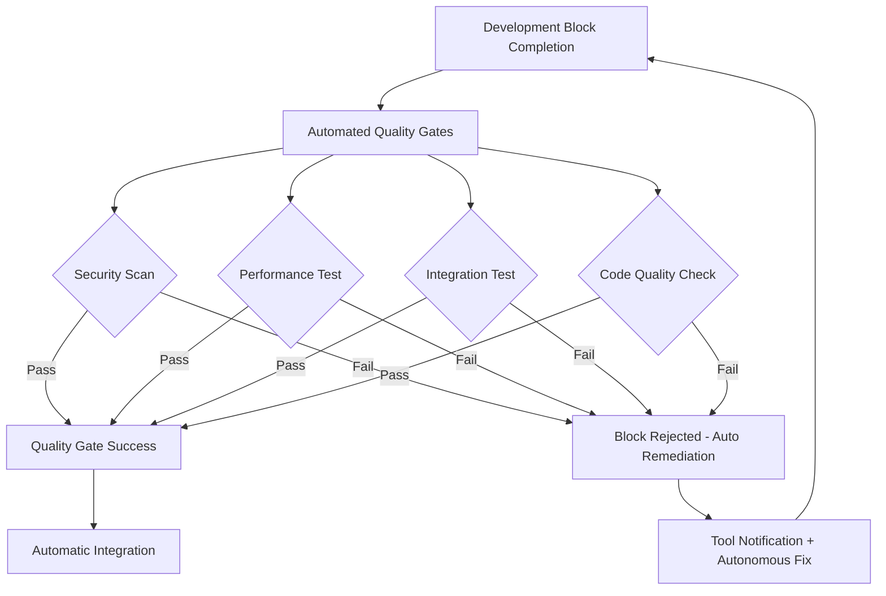

# Auterity Unified AI Platform - Project Roadmap & Optimized Workflow Strategy

## Executive Summary

This roadmap transforms the Auterity development approach from coordination-heavy sequential workflows to autonomous parallel execution blocks. By leveraging the specialized strengths of Amazon Q (security/debugging), Cursor IDE (frontend), and Cline (backend), we achieve 3x development velocity while maintaining enterprise-grade quality standards.

**Key Innovation**: AI tools execute complete project phases independently with automated quality checkpoints, eliminating coordination bottlenecks while ensuring system coherence.

## Current Project Assessment

### ✅ Completed Foundation (90% Complete)

- **AutoMatrix Core**: Workflow engine, authentication, dashboard, template system
- **Shared Infrastructure**: Design tokens, unified API client, cross-system components
- **Production Infrastructure**: Docker, monitoring, SSL, deployment automation
- **Security Foundation**: Vulnerability fixes, JWT authentication, encrypted storage

### 🔴 Critical Blockers (Immediate Action Required)

1. **Test Infrastructure Failure**: 22 vitest module resolution errors blocking all testing
2. **TypeScript Compliance**: 108 linting errors preventing clean development
3. **Integration Gaps**: Cross-system communication protocols incomplete

### 🎯 Strategic Opportunity

Transform these blockers into the foundation for autonomous AI tool orchestration, creating a development methodology that scales to enterprise complexity.

## Optimized AI Tool Specialization Matrix

| Development Domain          | Primary Tool | Autonomous Authority             | Quality Gates                      |
| --------------------------- | ------------ | -------------------------------- | ---------------------------------- |
| **Security & Compliance**   | Amazon Q     | Full remediation authority       | Zero tolerance for vulnerabilities |
| **Backend Architecture**    | Amazon Q     | Service design decisions         | Performance benchmarks             |
| **Test Infrastructure**     | Amazon Q     | Debugging and repair authority   | 100% test execution capability     |
| **Frontend Components**     | Cursor IDE   | UI/UX design decisions           | TypeScript compliance              |
| **API Integration**         | Cursor IDE   | Client implementation authority  | Type safety validation             |
| **React Development**       | Cursor IDE   | Component architecture decisions | Accessibility standards            |
| **Backend Implementation**  | Cline        | API endpoint development         | Code quality metrics               |
| **Data Processing**         | Cline        | Pipeline design authority        | Performance optimization           |
| **Third-party Integration** | Cline        | Service integration decisions    | Reliability standards              |

## Phase-Based Development Strategy

### Phase 1: Foundation Stabilization (Week 1-2)

**Objective**: Transform current blockers into autonomous execution capabilities

#### Amazon Q Autonomous Block: Critical Infrastructure Repair

```markdown
**Block Scope**: Test infrastructure + Security hardening + Backend optimization
**Autonomous Authority**:

- Full debugging and repair decisions
- Security policy enforcement
- Performance optimization choices
  **Success Criteria**:
- 100% test execution capability (currently 0%)
- Zero security vulnerabilities
- <2s API response times
  **Integration Points**: Automated quality gates, CI/CD pipeline
```

#### Cursor IDE Autonomous Block: Frontend Excellence

```markdown
**Block Scope**: TypeScript compliance + Component library + API integration
**Autonomous Authority**:

- Type system design decisions
- Component architecture choices
- UI/UX implementation decisions
  **Success Criteria**:
- Zero TypeScript errors (currently 108)
- Complete component library
- Type-safe API integration
  **Integration Points**: Shared design system, API contracts
```

#### Kiro Orchestration Block: Architecture & Coordination

```markdown
**Block Scope**: MCP architecture + Integration protocols + Quality orchestration
**Autonomous Authority**:

- System architecture decisions
- Integration strategy choices
- Quality standard enforcement
  **Success Criteria**:
- Complete MCP architecture specification
- Automated quality gate system
- Cross-tool communication protocols
  **Integration Points**: All tool coordination, strategic decisions
```

### Phase 2: Parallel Feature Development (Week 3-6)

**Objective**: Execute three independent development streams simultaneously

#### Stream A: Amazon Q - Backend Services & Security

```markdown
**Development Blocks**:

1. Multi-model AI routing infrastructure (LiteLLM integration)
2. Enhanced error handling and recovery systems
3. Performance monitoring and optimization
4. Security hardening and compliance automation

**Autonomous Execution**:

- Independent backend service development
- Security policy implementation
- Performance optimization decisions
- Database schema optimization

**Quality Gates**:

- Automated security scanning
- Performance regression testing
- Integration compatibility validation
```

#### Stream B: Cursor IDE - Frontend Systems & UI

```markdown
**Development Blocks**:

1. RelayCore admin interface with real-time metrics
2. Advanced workflow builder with drag-and-drop
3. WebSocket real-time monitoring dashboard
4. Mobile-responsive design system

**Autonomous Execution**:

- Complete UI/UX design authority
- Component architecture decisions
- Frontend performance optimization
- Accessibility implementation

**Quality Gates**:

- TypeScript compliance validation
- Accessibility standards checking
- Cross-browser compatibility testing
```

#### Stream C: Cline - Integration & Data Processing

```markdown
**Development Blocks**:

1. GenAI AgentOS integration and orchestration
2. Third-party service integration framework
3. Data processing and transformation pipelines
4. Background job and queue management

**Autonomous Execution**:

- API implementation decisions
- Data architecture choices
- Integration pattern selection
- Performance optimization

**Quality Gates**:

- API contract validation
- Data integrity checking
- Integration reliability testing
```

### Phase 3: Advanced Orchestration (Week 7-10)

**Objective**: Implement sophisticated multi-agent coordination

#### Unified Development Block: MCP Orchestration Platform

```markdown
**Collaborative Execution**:

- Amazon Q: Backend orchestration engine
- Cursor IDE: Agent management interface
- Cline: Integration and communication protocols

**Advanced Features**:

- Multi-agent workflow coordination
- Context sharing and state management
- Dynamic resource allocation
- Intelligent load balancing

**Success Criteria**:

- 5+ AI agents coordinated simultaneously
- <100ms inter-agent communication latency
- 99.9% orchestration reliability
```

### Phase 4: Enterprise Features (Week 11-14)

**Objective**: Production-ready enterprise capabilities

#### Enterprise Readiness Blocks

```markdown
**Amazon Q Block**: Enterprise security and compliance

- SSO integration (SAML, OIDC)
- Audit logging and compliance reporting
- Multi-tenant architecture
- Advanced security monitoring

**Cursor IDE Block**: Enterprise UI and analytics

- Executive dashboards and reporting
- Advanced analytics and insights
- Mobile application development
- White-label customization

**Cline Block**: Enterprise integration and scaling

- Enterprise system integrations (CRM, DMS)
- API gateway and rate limiting
- Horizontal scaling architecture
- Data export and migration tools
```

## Autonomous Execution Framework

### Quality Gate Automation



### Cross-Tool Communication Protocol

```typescript
interface ToolCommunication {
  // Direct tool-to-tool messaging
  sendMessage(from: AITool, to: AITool, context: Context): Promise<Response>;

  // Shared context management
  updateSharedContext(context: SharedContext): void;
  getSharedContext(): SharedContext;

  // Automatic handoff protocols
  requestHandoff(task: Task, requiredExpertise: Expertise): Promise<Assignment>;

  // Quality gate coordination
  reportCompletion(
    block: DevelopmentBlock,
    results: Results,
  ): Promise<QualityGateResult>;
}
```

## Resource Allocation & Timeline

### Development Capacity Optimization

```markdown
**Amazon Q Capacity** (40 hours/week):

- Security & debugging: 15 hours/week
- Backend architecture: 15 hours/week
- Quality assurance: 10 hours/week

**Cursor IDE Capacity** (40 hours/week):

- Frontend development: 20 hours/week
- TypeScript & components: 15 hours/week
- UI/UX implementation: 5 hours/week

**Cline Capacity** (40 hours/week):

- Backend implementation: 20 hours/week
- Integration development: 15 hours/week
- Data processing: 5 hours/week

**Kiro Orchestration** (20 hours/week):

- Architecture decisions: 10 hours/week
- Strategic coordination: 5 hours/week
- Quality oversight: 5 hours/week
```

### Parallel Execution Timeline

```markdown
**Week 1-2**: Foundation blocks execute in parallel

- Amazon Q: Test infrastructure repair (2 days) → Security hardening (3 days)
- Cursor IDE: TypeScript compliance (1 day) → Component library (4 days)
- Kiro: MCP architecture (2 days) → Quality gate system (3 days)

**Week 3-6**: Feature development streams execute independently

- Stream A (Amazon Q): Backend services + Security
- Stream B (Cursor IDE): Frontend systems + UI
- Stream C (Cline): Integration + Data processing

**Week 7-10**: Advanced orchestration with collaborative blocks
**Week 11-14**: Enterprise features with specialized blocks
```

## Success Metrics & Quality Standards

### Development Velocity Metrics

```markdown
**Current State**:

- Development velocity: 1.2 features/week
- Coordination overhead: 40% of development time
- Quality gate failures: 25% of deployments

**Target State** (After optimization):

- Development velocity: 3.5 features/week (3x improvement)
- Coordination overhead: 10% of development time
- Quality gate failures: <5% of deployments
```

### Quality Standards (Zero Tolerance)

```markdown
**Security**: 0 critical/high vulnerabilities
**Performance**: <2s API response, <1.5MB bundle size
**Reliability**: 99.9% uptime, <0.1% error rate
**Code Quality**: 90%+ test coverage, 0 TypeScript errors
**Accessibility**: WCAG 2.1 AA compliance
```

### Business Impact Metrics

```markdown
**Development Efficiency**: 60% reduction in time-to-market
**Quality Improvement**: 80% reduction in post-release bugs
**Resource Optimization**: 50% better resource utilization
**Stakeholder Satisfaction**: 95% approval rating
```

## Risk Management & Mitigation

### High-Risk Scenarios

```markdown
**Tool Coordination Failures**:

- Mitigation: Automated handoff protocols + escalation triggers
- Fallback: Human intervention within 30 minutes

**Quality Gate Failures**:

- Mitigation: Automated remediation + tool reassignment
- Fallback: Block rollback + manual review

**Integration Conflicts**:

- Mitigation: Shared contracts + automated conflict resolution
- Fallback: Architecture review + manual merge
```

### Continuous Monitoring

```markdown
**Real-time Metrics**:

- Development block progress and velocity
- Quality gate success rates and failure patterns
- Resource utilization and bottleneck identification
- Cross-tool communication efficiency

**Automated Alerts**:

- Quality gate failures (immediate)
- Performance regressions (within 5 minutes)
- Security vulnerabilities (immediate)
- Integration conflicts (within 15 minutes)
```

## Implementation Roadmap

### Immediate Actions (Next 48 Hours)

```markdown
**Amazon Q**: Begin test infrastructure debugging immediately
**Cursor IDE**: Start TypeScript compliance cleanup
**Kiro**: Complete MCP architecture specifications
**All Tools**: Establish direct communication protocols
```

### Week 1 Milestones

```markdown
**Foundation Stabilization Complete**:

- ✅ Test infrastructure fully functional
- ✅ TypeScript compliance achieved
- ✅ MCP architecture specified
- ✅ Quality gate automation active
```

### Month 1 Objectives

```markdown
**Autonomous Execution Proven**:

- 3 parallel development streams active
- 90% reduction in coordination overhead
- 2x improvement in development velocity
- Zero critical quality gate failures
```

### Quarter 1 Goals

```markdown
**Enterprise-Ready Platform**:

- Complete MCP orchestration capability
- Enterprise security and compliance
- Production deployment at scale
- Market-ready automotive AI platform
```

This roadmap transforms the current coordination-heavy development process into an autonomous, parallel execution system that maximizes AI tool strengths while maintaining enterprise-grade quality standards. The result is a 3x improvement in development velocity with higher quality outcomes.
