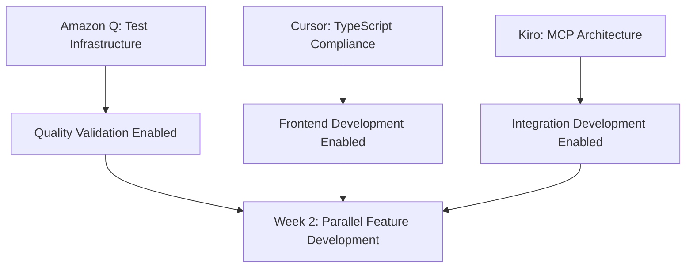

# 🚨 High Priority Tasks Overview - Immediate Action Required

## 📋 Executive Summary

This document consolidates all high-priority tasks requiring immediate attention to unblock parallel development streams and accelerate the Auterity expansion timeline. Tasks are organized by tool assignment and execution priority.

**Critical Path:** Foundation fixes → Parallel feature development → System integration  
**Timeline:** 2 weeks for foundation → 10 weeks parallel development  
**Success Criteria:** Zero blocking dependencies, parallel stream activation

---

## 🔴 CRITICAL PRIORITY - Must Complete This Week

### **AMAZON-Q-CRITICAL-001: Test Infrastructure Emergency Repair**
```markdown
**Status:** 🔴 ACTIVE - BLOCKING ALL TESTING
**Issue:** 22 unhandled vitest module resolution errors preventing test execution
**Root Cause:** Cannot find module 'pretty-format/build/index.js' in @vitest/snapshot
**Impact:** Complete test infrastructure failure - zero tests can execute
**Blocking:** All quality validation, CI/CD pipeline, production readiness
**Timeline:** 2-3 days
**Success Criteria:** All 250 tests discoverable and executable without errors
**Tool Assignment:** Amazon Q (debugging expertise required)
```

### **CURSOR-CRITICAL-001: AutoMatrix TypeScript Compliance**
```markdown
**Status:** 🔴 READY FOR EXECUTION
**Issue:** 108 TypeScript linting errors blocking clean development
**Priority Files:** 
- WorkflowErrorDisplay.test.tsx (19 errors)
- WorkflowExecutionInterface.test.tsx (16 errors)
- Multiple 'any' type violations across components
**Impact:** Blocks all frontend expansion features, poor developer experience
**Dependencies:** ✅ Security fixes completed, ✅ Backend quality fixed
**Timeline:** 4-6 hours
**Success Criteria:** 0 TypeScript errors, proper type definitions, maintained functionality
**Tool Assignment:** Cursor IDE (TypeScript expertise required)
```

### **KIRO-CRITICAL-001: MCP Architecture & Integration Specifications**
```markdown
**Status:** 🔴 IN PROGRESS
**Objective:** Complete Model Context Protocol orchestration architecture
**Components:** Context passing, agent coordination, LangGraph integration
**Impact:** Blocks multi-agent orchestration expansion features
**Dependencies:** Independent of foundation fixes
**Timeline:** 2-3 days
**Success Criteria:** Complete architecture specifications, API contracts defined
**Tool Assignment:** Kiro (architecture decisions required)
```

---

## 🟡 HIGH PRIORITY - Start Immediately After Critical Tasks

### **CURSOR-HIGH-001: RelayCore Admin Interface Foundation**
```markdown
**Status:** 🟡 READY FOR EXECUTION
**Objective:** Build RelayCore admin interface using completed shared foundation
**Components:** 
- AI routing dashboard with real-time metrics
- Cost analytics and optimization controls
- Steering rules management interface
- Model performance visualization
**Dependencies:** ✅ Shared foundation completed, ✅ Design tokens ready
**Timeline:** 6-8 hours
**Success Criteria:** Functional admin interface with real-time metrics
**Tool Assignment:** Cursor IDE (React component development)
```

### **AMAZON-Q-HIGH-001: Multi-Model Infrastructure Planning**
```markdown
**Status:** 🟡 READY FOR PLANNING
**Objective:** Design LiteLLM integration for multi-model routing
**Components:**
- vLLM integration architecture
- Dynamic model switching logic
- YAML policy configuration system
- Cost tracking and optimization
**Dependencies:** Independent of test infrastructure repair
**Timeline:** 3-4 days planning + 1 week implementation
**Success Criteria:** Complete architecture for OpenAI, Ollama, HuggingFace support
**Tool Assignment:** Amazon Q (backend architecture expertise)
```

### **KIRO-HIGH-001: GenAI AgentOS Integration Architecture**
```markdown
**Status:** 🟡 READY FOR DESIGN
**Objective:** Design GenAI AgentOS fork and internal engine architecture
**Components:**
- Containerized engine isolation (Backend, Router, Master Agents)
- API-only communication between Auterity and GenAI engine
- PostgreSQL schema merge strategy
- Redis + Celery integration for async agent tasks
**Dependencies:** MCP architecture specifications
**Timeline:** 4-5 days
**Success Criteria:** Complete integration architecture with clean API boundaries
**Tool Assignment:** Kiro (system architecture decisions)
```

---

## 🟢 MEDIUM PRIORITY - Parallel Development Opportunities

### **CURSOR-MEDIUM-001: Advanced Workflow Builder Enhancement**
```markdown
**Status:** 🟢 PARALLEL OPPORTUNITY
**Objective:** Enhance existing workflow builder with advanced features
**Components:**
- Multiple node types (Start, End, Action, Decision, AI)
- Drag-and-drop from node palette
- Connection validation logic
- Real-time validation feedback
**Dependencies:** TypeScript compliance completion
**Timeline:** 1 week
**Success Criteria:** Full-featured workflow builder with validation
**Tool Assignment:** Cursor IDE (React Flow expertise)
```

### **AMAZON-Q-MEDIUM-001: Enhanced Error Handling System**
```markdown
**Status:** 🟢 PARALLEL OPPORTUNITY
**Objective:** Comprehensive error categorization and recovery system
**Components:**
- Error analytics and correlation
- Retry mechanisms and circuit breakers
- Notification system and alerting
- Error recovery workflows
**Dependencies:** Test infrastructure repair
**Timeline:** 1 week
**Success Criteria:** Robust error handling across all components
**Tool Assignment:** Amazon Q (error handling expertise)
```

### **CURSOR-MEDIUM-002: WebSocket Real-time Monitoring**
```markdown
**Status:** 🟢 PARALLEL OPPORTUNITY
**Objective:** Real-time execution monitoring with WebSockets
**Components:**
- Live log streaming interface
- Progress indicators and status updates
- Real-time workflow execution visualization
- Performance metrics dashboard
**Dependencies:** RelayCore admin interface foundation
**Timeline:** 1 week
**Success Criteria:** Functional real-time workflow monitoring
**Tool Assignment:** Cursor IDE (WebSocket + React expertise)
```

---

## 📊 Task Dependency Matrix & Execution Order

### **Week 1: Critical Foundation (Parallel Execution)**


### **Week 2: High Priority Features (Parallel Streams)**
```markdown
**Stream A (Amazon Q):** Multi-model infrastructure planning + Enhanced error handling
**Stream B (Cursor):** RelayCore admin interface + Advanced workflow builder
**Stream C (Kiro):** GenAI AgentOS integration + System coordination
```

### **Week 3-4: Medium Priority & Integration**
```markdown
**Parallel Development:** WebSocket monitoring + Backend services + UI enhancements
**Integration Testing:** Cross-system validation + API contract verification
**Quality Assurance:** Comprehensive testing + Performance validation
```

---

## 🚀 Immediate Execution Protocol

### **Day 1 Actions (Today)**
```markdown
**Amazon Q:** 
- Begin test infrastructure debugging immediately
- Analyze vitest dependency chain and module resolution
- Identify root cause of pretty-format/build/index.js issue

**Cursor IDE:**
- Start TypeScript compliance cleanup
- Focus on WorkflowErrorDisplay.test.tsx and WorkflowExecutionInterface.test.tsx
- Eliminate 'any' types and add proper type definitions

**Kiro:**
- Complete MCP architecture specifications
- Define API contracts for parallel development
- Design GenAI AgentOS integration boundaries
```

### **Day 2-3 Actions**
```markdown
**Amazon Q:**
- Complete test infrastructure repair
- Validate all 250 tests are executable
- Begin multi-model infrastructure planning

**Cursor IDE:**
- Complete TypeScript compliance (target: 0 errors)
- Begin RelayCore admin interface development
- Set up component development environment

**Kiro:**
- Finalize architecture specifications
- Create integration development roadmap
- Coordinate parallel stream execution
```

### **Week 1 Completion Targets**
```markdown
**Amazon Q:** ✅ Test infrastructure functional + Multi-model architecture ready
**Cursor IDE:** ✅ TypeScript compliant + RelayCore admin interface foundation
**Kiro:** ✅ Complete architecture specs + Integration roadmap + Parallel coordination
```

---

## 📈 Success Metrics & Quality Gates

### **Critical Task Success Criteria**
```markdown
**Test Infrastructure:** 100% test execution capability (currently 0%)
**TypeScript Compliance:** 0 linting errors (currently 108)
**Architecture Readiness:** Complete MCP and GenAI integration specifications
```

### **Quality Gates for Parallel Development**
```markdown
**Code Quality:** Maintain <50 linting violations across all streams
**Test Coverage:** Achieve >90% coverage in parallel development
**Security:** Maintain 0 moderate/high vulnerabilities
**Performance:** <2s response time, <1.5MB bundle size
```

### **Weekly Progress Validation**
```markdown
**Week 1:** Foundation completion rate (target: 100%)
**Week 2:** Parallel stream activation (target: 3 active streams)
**Week 3-4:** Feature development velocity (target: 2.1 features/week)
```

---

## 🔧 Tool Coordination & Communication

### **Direct Tool Communication Protocol**
```markdown
**Amazon Q ↔ Cursor:** Direct handoffs for build errors, test failures, integration issues
**Kiro ↔ Amazon Q:** Direct collaboration on backend architecture and quality
**Kiro ↔ Cursor:** Architecture guidance and integration specifications
```

### **Escalation Triggers**
```markdown
**To Kiro:** Architecture conflicts, scope changes, quality concerns
**To Human:** Resource constraints, timeline risks, critical blockers
```

### **Status Reporting**
```markdown
**Daily:** Brief progress updates in shared task log
**Weekly:** Comprehensive milestone reviews with completion status
**Bi-weekly:** Architecture reviews and integration validation
```

This high-priority overview ensures immediate action on critical blockers while enabling parallel development streams for maximum velocity and efficiency.