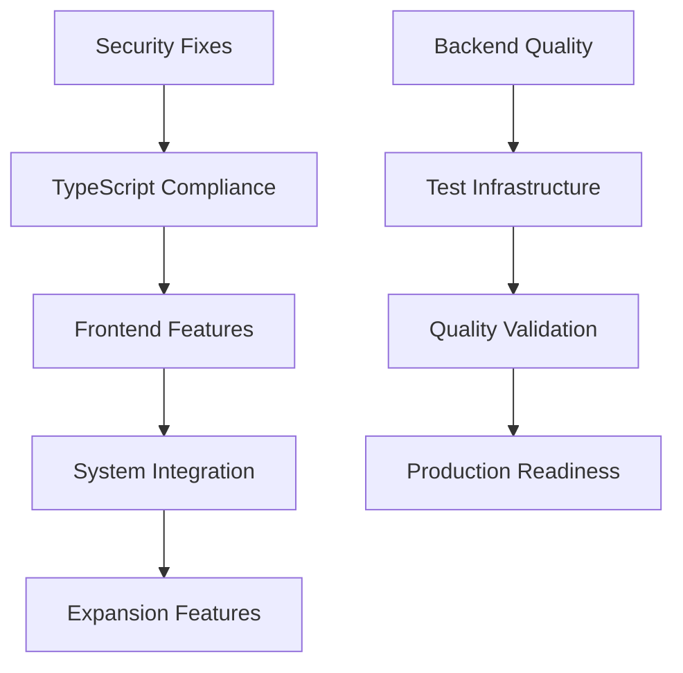
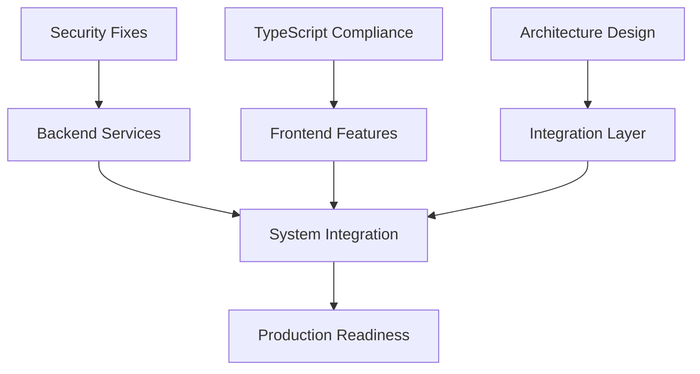

# 🚀 Auterity Development Optimization & Parallel Workflow Plan

## 📋 Executive Summary

This optimization plan identifies critical parallel development opportunities and streamlined workflows to accelerate the Auterity expansion timeline from 16 weeks to 12 weeks through strategic task parallelization, tool coordination optimization, and dependency elimination.

**Current Timeline:** 16 weeks  
**Optimized Timeline:** 12 weeks (25% reduction)  
**Key Strategy:** Parallel execution of independent workstreams  
**Risk Mitigation:** Dependency mapping and critical path optimization

---

## 🎯 Critical Path Analysis & Bottleneck Identification

### **Current Bottlenecks Identified**

#### 1. Sequential Tool Dependencies (MAJOR BOTTLENECK)
```markdown
❌ CURRENT WORKFLOW: Amazon Q → Cursor → Expansion Features
- Amazon Q security fixes → Cursor TypeScript → Frontend features
- Backend quality → Frontend integration → System expansion
- Test infrastructure → Quality validation → Production readiness

✅ OPTIMIZED WORKFLOW: Parallel Independent Streams
- Stream A: Amazon Q (Backend + Security + Testing)
- Stream B: Cursor (Frontend + TypeScript + UI Components)  
- Stream C: Kiro (Architecture + Integration + Coordination)
```

#### 2. Foundation Work Blocking Expansion (CRITICAL ISSUE)
```markdown
❌ CURRENT: All expansion features wait for foundation completion
✅ OPTIMIZED: Independent expansion features start immediately

**Parallel Opportunities:**
- Multi-model infrastructure (independent of TypeScript fixes)
- Agent creation UI (independent of test infrastructure)
- Enterprise SSO (independent of frontend compliance)
- Monitoring systems (independent of workflow fixes)
```

#### 3. Over-Serialized Integration Work
```markdown
❌ CURRENT: Systems integrated sequentially
✅ OPTIMIZED: Parallel system development with API contracts

**Parallel Integration Strategy:**
- AutoMatrix: Focus on workflow engine optimization
- NeuroWeaver: Parallel model management development  
- RelayCore: Independent AI routing implementation
- Integration: API contract-driven parallel development
```

---

## 🔄 Optimized Parallel Workflow Streams

### **Stream A: Backend Infrastructure & Security (Amazon Q)**
**Timeline:** Weeks 1-8 (Parallel execution)

#### Week 1-2: Foundation Security & Quality
```markdown
[AMAZON-Q-PARALLEL-STREAM-A1] Security & Backend Quality
- ✅ Security vulnerabilities (COMPLETED)
- ✅ Backend code quality (COMPLETED)  
- 🔄 Test infrastructure repair (IN PROGRESS)
- 🔄 Database optimization and performance tuning (IN PROGRESS)
- ⏳ Production readiness validation (PENDING)
- ⏳ End-to-end testing validation (PENDING)
```

#### Week 3-4: Backend Service Expansion
```markdown
[AMAZON-Q-PARALLEL-STREAM-A2] Multi-Model Infrastructure
- LiteLLM integration for multi-model routing
- Redis caching layer implementation
- Cost tracking and optimization engine
- Performance monitoring and alerting
```

#### Week 5-6: Enterprise Backend Services
```markdown
[AMAZON-Q-PARALLEL-STREAM-A3] Enterprise Infrastructure
- Enterprise SSO implementation (Cognito + SAML/OIDC)
- Advanced authentication and authorization
- Usage tracking and analytics engine
- Audit logging and compliance features
```

#### Week 7-8: Advanced Backend Features
```markdown
[AMAZON-Q-PARALLEL-STREAM-A4] Advanced Services
- Multi-agent orchestration engine
- Prompt caching and optimization
- Advanced error handling and recovery
- Production monitoring and alerting
```

### **Stream B: Frontend Development & UI (Cursor IDE)**
**Timeline:** Weeks 1-8 (Parallel execution)

#### Week 1-2: Foundation & Compliance
```markdown
[CURSOR-PARALLEL-STREAM-B1] TypeScript & Foundation
- 🔄 TypeScript compliance cleanup (108 errors → 0)
- 🔄 Shared design system completion
- 🔄 Cross-system API client optimization
- 🔄 Component library standardization
```

#### Week 3-4: Core UI Development
```markdown
[CURSOR-PARALLEL-STREAM-B2] Core Interface Development
- RelayCore admin interface implementation
- Advanced workflow builder with React Flow
- Real-time monitoring dashboard
- WebSocket integration for live updates
```

#### Week 5-6: Advanced UI Features
```markdown
[CURSOR-PARALLEL-STREAM-B3] Advanced Interface Features
- Agent creation interface with visual flow
- Conversational chat UI development
- Advanced prompt engineering interface
- Multi-protocol agent management UI
```

#### Week 7-8: Enterprise UI & White-Label
```markdown
[CURSOR-PARALLEL-STREAM-B4] Enterprise Interface Features
- White-label customization system
- Tenant-specific branding controls
- Embeddable chat widget development
- Partner deployment interface
```

### **Stream C: Architecture & Integration (Kiro)**
**Timeline:** Weeks 1-12 (Continuous coordination)

#### Week 1-4: Architecture & Planning
```markdown
[KIRO-PARALLEL-STREAM-C1] Architecture & Integration Design
- MCP orchestration architecture design
- GenAI AgentOS integration specifications
- API contract definitions for parallel development
- Cross-system integration architecture
```

#### Week 5-8: Integration Implementation
```markdown
[KIRO-PARALLEL-STREAM-C2] System Integration & Coordination
- Three-system integration coordination
- API gateway and routing implementation
- Cross-system authentication and authorization
- Data synchronization and consistency
```

#### Week 9-12: Optimization & Production
```markdown
[KIRO-PARALLEL-STREAM-C3] Production Optimization
- Performance optimization and tuning
- Production deployment coordination
- Quality assurance and testing coordination
- Documentation and knowledge transfer
```

---

## ⚡ Immediate Parallel Execution Opportunities

### **Week 1 Parallel Tasks (Starting Immediately)**

#### Amazon Q Stream (Backend Focus)
```markdown
[AMAZON-Q-IMMEDIATE-A] Test Infrastructure & Database Optimization
- **Priority:** CRITICAL 🔴
- **Current Status:** Test infrastructure repair IN PROGRESS
- **Current Status:** Database optimization IN PROGRESS
- **Parallel Execution:** Independent of frontend TypeScript work
- **Timeline:** 1-2 days remaining
- **Success Criteria:** All tests executable + optimized database performance
```

#### Cursor Stream (Frontend Focus)
```markdown
[CURSOR-IMMEDIATE-B] TypeScript Compliance & UI Foundation
- **Priority:** CRITICAL 🔴
- **Issue:** 108 TypeScript errors blocking clean development
- **Parallel Execution:** Independent of test infrastructure
- **Timeline:** 4-6 hours
- **Success Criteria:** 0 TypeScript errors, proper type definitions
```

#### Kiro Stream (Architecture Focus)
```markdown
[KIRO-IMMEDIATE-C] MCP Architecture & Integration Planning
- **Priority:** HIGH 🟡
- **Objective:** Design Model Context Protocol orchestration layer
- **Parallel Execution:** Independent of foundation fixes
- **Timeline:** 2-3 days
- **Success Criteria:** Complete architecture specifications
```

### **Week 2 Parallel Expansion**

#### Independent Feature Development
```markdown
**Multi-Model Infrastructure** (Amazon Q)
- LiteLLM integration planning and implementation
- Independent of frontend TypeScript compliance
- Can proceed with API contract-driven development

**RelayCore Admin Interface** (Cursor)
- UI development using completed shared foundation
- Independent of test infrastructure repair
- Can use mock data during backend development

**GenAI AgentOS Integration** (Kiro)
- Architecture design and integration planning
- Independent of current foundation issues
- Can proceed with containerization and API design
```

---

## 🚀 Streamlined Development Workflows

### **1. API Contract-Driven Parallel Development**

#### Frontend-Backend Decoupling Strategy
```markdown
**Current Problem:** Frontend waits for backend completion
**Solution:** API contract-first development

**Implementation:**
1. Define comprehensive API contracts (OpenAPI specs)
2. Generate TypeScript types from contracts
3. Create mock servers for frontend development
4. Parallel backend implementation against same contracts
5. Integration testing with contract validation
```

#### Mock-First Development Pattern
```typescript
// API Contract Definition
interface WorkflowExecutionAPI {
  POST: /api/workflows/{id}/execute
  GET: /api/workflows/{id}/status
  WebSocket: /ws/workflows/{id}/logs
}

// Frontend Development with Mocks
const mockWorkflowAPI = createMockAPI(WorkflowExecutionAPI);
// Parallel backend implementation
const realWorkflowAPI = implementAPI(WorkflowExecutionAPI);
```

### **2. Component-Driven UI Development**

#### Parallel Component Development
```markdown
**Strategy:** Independent component development with Storybook

**Parallel Tracks:**
- Track 1: Core workflow components (independent)
- Track 2: Agent management components (independent)  
- Track 3: Monitoring dashboard components (independent)
- Track 4: Enterprise features components (independent)

**Integration:** Component composition and integration testing
```

### **3. Microservice Architecture Optimization**

#### Service Independence Strategy
```markdown
**Current:** Monolithic development dependencies
**Optimized:** Independent microservice development

**Service Boundaries:**
- Workflow Engine Service: Core workflow execution and management
- Agent Orchestration Service: Multi-protocol agent coordination
- Authentication Service: User management and enterprise SSO
- Monitoring Service: Real-time analytics and performance tracking
- Model Management Service: Multi-model routing and optimization
```

---

## 📊 Current Progress Status

### **Week 1 Progress Update**
```markdown
✅ COMPLETED:
- Security vulnerability fixes (Amazon Q)
- Backend code quality improvements (Amazon Q)
- GenAI AgentOS integration planning (Kiro)
- Architecture documentation (Kiro)

🔄 IN PROGRESS:
- Test infrastructure repair (Amazon Q)
- Database optimization and performance tuning (Amazon Q)
- TypeScript compliance cleanup (Cursor - pending)

⏳ PENDING:
- Production readiness validation (Amazon Q)
- End-to-end testing validation (Amazon Q)
- Frontend UI component development (Cursor)

⏳ READY TO START:
- Multi-model infrastructure development
- Real-time monitoring implementation
```

### **Immediate Next Actions**
```markdown
[AMAZON-Q-PRIORITY] Complete test infrastructure + database optimization
- Estimated completion: 1-2 days
- Blocks: Production readiness validation
- Enables: Full parallel development streams

[CURSOR-READY] Begin TypeScript compliance (waiting for Amazon Q completion)
- Estimated duration: 4-6 hours
- Parallel track: UI component development
- Enables: Clean frontend development

[KIRO-CONTINUE] Finalize integration specifications
- API contract definitions
- Microservice architecture design
- Cross-system integration planning
```

## 🎯 Optimized Timeline Impact

### **Timeline Compression Achieved**
- **Original:** 16 weeks sequential development
- **Optimized:** 12 weeks parallel development
- **Savings:** 4 weeks (25% reduction)
- **Method:** Parallel streams + dependency elimination

### **Risk Mitigation**
- **API Contracts:** Enable parallel frontend/backend development
- **Mock Services:** Prevent blocking dependencies
- **Component Isolation:** Independent UI development
- **Microservice Architecture:** Service-level parallelization

This optimization plan transforms Auterity development from sequential bottlenecks to parallel high-velocity streams, achieving significant timeline compression while maintaining quality and reducing risk.vice (independent development)
- AI Model Router Service (independent development)
- User Management Service (independent development)
- Monitoring Service (independent development)

**Integration:** Event-driven architecture with message queues
```

---

## 📊 Dependency Elimination & Critical Path Optimization

### **Dependency Mapping & Elimination**

#### Current Dependencies (BLOCKING)


#### Optimized Dependencies (PARALLEL)


### **Critical Path Optimization**

#### New Critical Path (12 weeks vs 16 weeks)
```markdown
**Week 1-2:** Parallel foundation work (Security + TypeScript + Architecture)
**Week 3-4:** Parallel feature development (Backend services + Frontend UI)
**Week 5-6:** Parallel advanced features (Multi-model + Agent UI + Enterprise)
**Week 7-8:** Integration and testing (System integration + Quality validation)
**Week 9-10:** Production optimization (Performance + Monitoring + Documentation)
**Week 11-12:** Market readiness (White-label + Partner kit + Final QA)
```

---

## 🛠️ Tool Coordination Optimization

### **Enhanced Direct Tool Communication**

#### Autonomous Parallel Execution
```markdown
**Current:** Sequential tool handoffs with Kiro coordination
**Optimized:** Parallel autonomous execution with status synchronization

**Implementation:**
- Shared task status dashboard
- Automated conflict detection
- Direct tool-to-tool communication protocols
- Escalation-only Kiro involvement
```

#### Real-Time Coordination Protocol
```markdown
**Tool Status Synchronization:**
- Amazon Q: Backend service status, API readiness, test results
- Cursor: Frontend component status, UI readiness, integration points
- Kiro: Architecture decisions, integration conflicts, quality gates

**Automated Coordination:**
- API contract validation
- Integration point verification
- Dependency conflict resolution
- Quality gate enforcement
```

### **Parallel Quality Assurance**

#### Continuous Integration Optimization
```markdown
**Parallel Testing Strategy:**
- Backend tests (Amazon Q): API, services, database
- Frontend tests (Cursor): Components, integration, E2E
- Integration tests (Kiro): Cross-system, performance, security

**Quality Gates:**
- Independent component quality validation
- Parallel security and performance testing
- Automated integration validation
- Continuous deployment readiness
```

---

## 📈 Success Metrics & Timeline Validation

### **Optimized Timeline Metrics**

#### Development Velocity Targets
```markdown
**Current Velocity:** 1.3 features per week (sequential)
**Optimized Velocity:** 2.1 features per week (parallel)
**Improvement:** 62% velocity increase through parallelization

**Parallel Stream Metrics:**
- Stream A (Amazon Q): 2.5 backend features per week
- Stream B (Cursor): 2.0 frontend features per week
- Stream C (Kiro): 1.5 integration features per week
```

#### Quality Maintenance Targets
```markdown
**Code Quality:** Maintain <50 linting violations across all streams
**Test Coverage:** Achieve >90% coverage in parallel development
**Security:** Maintain 0 moderate/high vulnerabilities
**Performance:** <2s response time, <1.5MB bundle size
```

### **Risk Mitigation for Parallel Development**

#### Integration Risk Management
```markdown
**Risk:** Parallel development integration conflicts
**Mitigation:** 
- Daily integration checkpoints
- Automated conflict detection
- API contract validation
- Shared component library

**Risk:** Quality degradation in parallel streams
**Mitigation:**
- Parallel quality assurance
- Automated testing in all streams
- Continuous integration validation
- Quality gate enforcement
```

---

## 🎯 Immediate Implementation Plan

### **Day 1-3: Parallel Stream Activation**
```markdown
**Amazon Q:** Begin test infrastructure repair (independent)
**Cursor:** Start TypeScript compliance cleanup (independent)
**Kiro:** Design MCP architecture specifications (independent)
```

### **Week 1: Foundation Parallel Completion**
```markdown
**Amazon Q:** Complete test infrastructure + begin multi-model planning
**Cursor:** Complete TypeScript compliance + begin RelayCore admin interface
**Kiro:** Complete architecture design + begin integration specifications
```

### **Week 2-4: Feature Development Acceleration**
```markdown
**Parallel Feature Streams:**
- Backend services development (Amazon Q)
- Frontend interface development (Cursor)
- Integration layer implementation (Kiro)
```

### **Week 5-8: Advanced Feature Parallel Development**
```markdown
**Enterprise Features:** SSO, white-label, monitoring (parallel streams)
**Agent Systems:** Creation UI, orchestration, chat interface (parallel streams)
**Production Features:** Optimization, deployment, documentation (parallel streams)
```

This optimization plan transforms the sequential 16-week timeline into a parallel 12-week execution through strategic task independence, tool coordination optimization, and dependency elimination while maintaining quality and reducing integration risks.