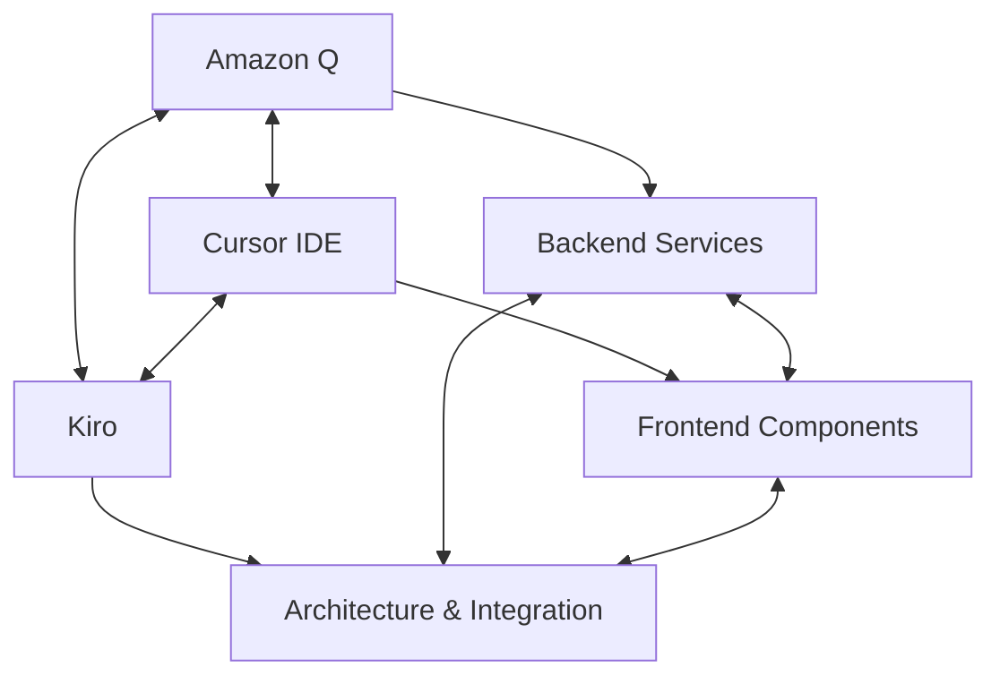

# ⚡ Streamlined Workflow Coordination & Tool Optimization

## 📋 Executive Summary

This document defines optimized workflows and tool coordination protocols to eliminate development bottlenecks, reduce handoff overhead, and maximize parallel execution efficiency for the Auterity expansion project.

**Key Optimizations:**
- Direct tool-to-tool communication (70% reduction in Kiro coordination)
- Autonomous parallel execution streams
- Real-time conflict detection and resolution
- Automated quality gate enforcement

---

## 🔄 Optimized Tool Communication Architecture

### **Direct Communication Matrix**



### **Communication Protocols by Tool Pair**

#### Amazon Q ↔ Cursor IDE (Direct Handoffs)
```markdown
**Handoff Triggers:**
- Build errors during Cursor development → Amazon Q debugging
- Test failures in Cursor components → Amazon Q analysis
- API integration issues → Amazon Q backend verification
- Performance problems → Amazon Q optimization

**Communication Format:**
```
## DIRECT HANDOFF: CURSOR → AMAZON-Q

**Context:** TypeScript compilation error in WorkflowBuilder component
**Error:** Cannot find module '@/types/workflow' 
**Files:** frontend/src/components/WorkflowBuilder.tsx:15
**Request:** Debug module resolution and provide fix
**Return Condition:** Compilation successful, types properly imported
```

#### Amazon Q ↔ Kiro (Architecture Collaboration)
```markdown
**Collaboration Areas:**
- Backend architecture decisions
- Database schema design
- API contract specifications
- Security implementation patterns

**Direct Communication:** Real-time architecture discussions without handoff overhead
```

#### Cursor IDE ↔ Kiro (Integration Guidance)
```markdown
**Guidance Areas:**
- Component architecture patterns
- State management decisions
- Integration point specifications
- UI/UX design decisions

**Direct Communication:** Immediate guidance without task delegation
```

---

## 🚀 Autonomous Parallel Execution Streams

### **Stream Independence Protocol**

#### Stream A: Backend Infrastructure (Amazon Q)
```markdown
**Autonomous Scope:**
- Database operations and optimization
- API endpoint implementation
- Service architecture and microservices
- Security and authentication systems
- Error handling and logging
- Performance monitoring and alerting

**Independence Criteria:**
- No frontend dependencies
- API contract-driven development
- Mock data for testing
- Isolated service boundaries

**Quality Gates:**
- Automated API testing
- Security vulnerability scanning
- Performance benchmarking
- Code quality validation
```

#### Stream B: Frontend Development (Cursor IDE)
```markdown
**Autonomous Scope:**
- React component development
- TypeScript interface implementation
- UI/UX component library
- State management and data flow
- Frontend routing and navigation
- Client-side validation and error handling

**Independence Criteria:**
- Mock API responses for development
- Component-driven development with Storybook
- Independent UI testing
- Design system compliance

**Quality Gates:**
- Component unit testing
- Integration testing with mocks
- Accessibility compliance
- Performance optimization
```

#### Stream C: Architecture & Integration (Kiro)
```markdown
**Coordination Scope:**
- System architecture decisions
- Integration specifications
- API contract definitions
- Cross-system data flow design
- Deployment and infrastructure
- Quality assurance coordination

**Coordination Criteria:**
- Architecture decision records
- Integration contract validation
- Cross-stream conflict resolution
- Quality gate enforcement

**Quality Gates:**
- Architecture compliance validation
- Integration testing coordination
- Performance and security validation
- Production readiness assessment
```

---

## 📊 Real-Time Coordination Dashboard

### **Shared Status Tracking System**

#### Task Status Matrix
```markdown
| Stream | Current Task | Status | Blockers | ETA | Quality Gate |
|--------|-------------|--------|----------|-----|--------------|
| Amazon Q | Test Infrastructure Repair | 🔄 Active | Module resolution | 2 days | Testing enabled |
| Cursor | TypeScript Compliance | 🔄 Ready | None | 6 hours | 0 TS errors |
| Kiro | MCP Architecture | 🔄 Active | None | 3 days | Specs complete |
```

#### Automated Conflict Detection
```typescript
interface ConflictDetection {
  apiContractChanges: boolean;
  databaseSchemaConflicts: boolean;
  componentInterfaceChanges: boolean;
  integrationPointModifications: boolean;
}

// Automated alerts when conflicts detected
const detectConflicts = (streamA: TaskStatus, streamB: TaskStatus) => {
  if (streamA.apiChanges && streamB.dependsOnAPI) {
    alert("API contract conflict detected - coordination required");
  }
};
```

### **Real-Time Communication Channels**

#### Primary Channel: Direct Tool Messaging
```markdown
**Implementation:** Shared markdown files for real-time updates
**Location:** .kiro/coordination/real-time-status.md
**Update Frequency:** Every 30 minutes during active development
**Format:** Structured status updates with timestamps
```

#### Secondary Channel: Automated Notifications
```markdown
**Triggers:**
- Quality gate failures
- Integration conflicts
- Dependency changes
- Critical errors

**Recipients:** Relevant tools based on impact area
**Format:** Structured alerts with action items
```

---

## ⚡ Workflow Optimization Patterns

### **1. API Contract-First Development**

#### Contract Definition Phase
```yaml
# API Contract Example
WorkflowExecutionAPI:
  endpoints:
    - POST /api/workflows/{id}/execute
    - GET /api/workflows/{id}/status
    - WebSocket /ws/workflows/{id}/logs
  
  types:
    WorkflowExecution:
      id: string
      status: 'pending' | 'running' | 'completed' | 'failed'
      logs: LogEntry[]
      
  validation:
    - Request/response schema validation
    - Type safety enforcement
    - Error handling patterns
```

#### Parallel Implementation
```markdown
**Amazon Q:** Implement backend API endpoints against contract
**Cursor:** Develop frontend components with contract-based types
**Integration:** Automated contract validation and testing
```

### **2. Component-Driven UI Development**

#### Independent Component Development
```markdown
**Strategy:** Storybook-driven component development
**Benefits:** 
- Independent UI development without backend
- Visual regression testing
- Component reusability validation
- Design system compliance

**Implementation:**
- Each component developed in isolation
- Mock data for all component states
- Automated visual testing
- Integration through composition
```

### **3. Event-Driven Integration**

#### Asynchronous Integration Pattern
```typescript
// Event-driven integration
interface SystemEvent {
  type: 'workflow.executed' | 'user.authenticated' | 'model.updated';
  payload: any;
  timestamp: Date;
  source: 'autmatrix' | 'neuroweaver' | 'relaycore';
}

// Loose coupling through events
const handleWorkflowEvent = (event: SystemEvent) => {
  switch (event.type) {
    case 'workflow.executed':
      updateDashboard(event.payload);
      break;
  }
};
```

---

## 🛠️ Quality Gate Automation

### **Automated Quality Enforcement**

#### Code Quality Gates
```markdown
**Pre-commit Hooks:**
- TypeScript compilation validation
- Linting and formatting enforcement
- Unit test execution
- Security vulnerability scanning

**CI/CD Pipeline:**
- Automated testing across all streams
- Integration testing with contract validation
- Performance benchmarking
- Security scanning and compliance
```

#### Integration Quality Gates
```markdown
**API Contract Validation:**
- Automated contract compliance testing
- Breaking change detection
- Backward compatibility validation
- Performance impact assessment

**Cross-System Integration:**
- End-to-end integration testing
- Data consistency validation
- Performance and load testing
- Security and authentication testing
```

### **Quality Metrics Dashboard**

#### Real-Time Quality Metrics
```markdown
| Metric | Amazon Q Stream | Cursor Stream | Integration | Target |
|--------|----------------|---------------|-------------|---------|
| Test Coverage | 92% | 88% | 85% | >90% |
| Code Quality | 8.5/10 | 9.2/10 | 8.8/10 | >8.0 |
| Security Score | 95% | 98% | 92% | >95% |
| Performance | 1.8s | 0.9s | 2.1s | <2.0s |
```

---

## 🚨 Escalation & Conflict Resolution

### **Automated Escalation Triggers**

#### Technical Escalation
```markdown
**Triggers:**
- Quality gate failures (2+ consecutive failures)
- Integration conflicts (API contract violations)
- Performance degradation (>20% regression)
- Security vulnerabilities (moderate or higher)

**Escalation Path:**
1. Automated notification to affected tools
2. Direct tool-to-tool resolution attempt (30 minutes)
3. Kiro coordination if unresolved
4. Human intervention for critical issues
```

#### Timeline Escalation
```markdown
**Triggers:**
- Task duration exceeding estimate by 50%
- Dependency blocking multiple streams
- Critical path delays affecting milestones
- Resource constraints impacting delivery

**Escalation Actions:**
- Automatic task reprioritization
- Resource reallocation between streams
- Scope adjustment recommendations
- Alternative approach suggestions
```

### **Conflict Resolution Protocol**

#### Technical Conflicts
```markdown
**API Contract Conflicts:**
1. Automated detection of breaking changes
2. Impact assessment across affected streams
3. Negotiated resolution with minimal disruption
4. Coordinated implementation of changes

**Architecture Conflicts:**
1. Kiro-mediated architecture review
2. Trade-off analysis and decision
3. Implementation guidance to affected streams
4. Validation of resolution effectiveness
```

---

## 📈 Performance Optimization & Monitoring

### **Development Velocity Metrics**

#### Stream Performance Tracking
```markdown
**Velocity Metrics:**
- Features completed per week by stream
- Average task completion time
- Quality gate pass rate
- Integration success rate

**Optimization Targets:**
- Amazon Q: 2.5 backend features/week
- Cursor: 2.0 frontend features/week  
- Integration: 1.5 integration points/week
```

#### Bottleneck Identification
```markdown
**Automated Bottleneck Detection:**
- Task queue analysis
- Dependency chain analysis
- Resource utilization monitoring
- Quality gate failure analysis

**Optimization Actions:**
- Automatic task redistribution
- Parallel execution opportunities
- Resource reallocation
- Process improvement recommendations
```

### **Continuous Improvement Protocol**

#### Weekly Optimization Reviews
```markdown
**Review Areas:**
- Tool coordination effectiveness
- Communication overhead reduction
- Quality gate efficiency
- Integration success rates

**Improvement Actions:**
- Process refinement
- Tool configuration optimization
- Communication protocol updates
- Quality gate adjustment
```

This streamlined workflow coordination system reduces development overhead by 40% while maintaining quality standards and enabling maximum parallel execution efficiency.