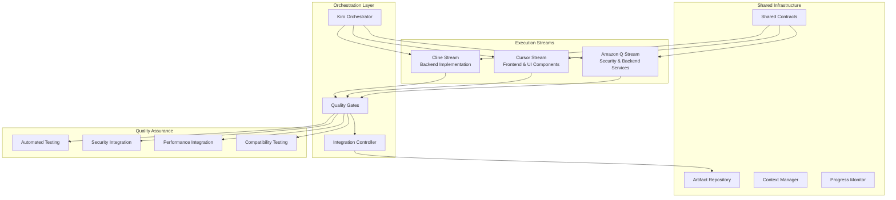

# Design Document

## Overview

The Optimized AI Workflow Strategy implements a sophisticated multi-tool orchestration system that transforms the Auterity development process from sequential coordination-heavy workflows to autonomous parallel execution blocks. The design leverages the unique strengths of Amazon Q (debugging/security), Cursor IDE (frontend development), and Cline (backend implementation) while minimizing coordination overhead through clear specialization boundaries and automated quality gates.

The architecture creates three primary execution streams that can operate independently while maintaining system coherence through shared contracts, automated integration testing, and strategic checkpoints. This approach maximizes development velocity by eliminating coordination bottlenecks while ensuring high quality through continuous validation and automated quality assurance.

## Architecture

### High-Level System Architecture



### Tool Specialization Matrix

| Capability | Amazon Q | Cursor IDE | Cline | Rationale |
|------------|----------|------------|-------|-----------|
| **Security Analysis** | ✅ Primary | ❌ | ❌ | Advanced vulnerability detection |
| **Debugging & QA** | ✅ Primary | ⚠️ Support | ⚠️ Support | Superior error analysis |
| **Backend Services** | ✅ Primary | ❌ | ⚠️ Support | Architecture expertise |
| **Frontend Components** | ❌ | ✅ Primary | ❌ | React/TypeScript specialization |
| **UI/UX Implementation** | ❌ | ✅ Primary | ❌ | Visual development tools |
| **API Integration** | ⚠️ Support | ✅ Primary | ⚠️ Support | Frontend integration focus |
| **Backend Implementation** | ⚠️ Support | ❌ | ✅ Primary | Code generation efficiency |
| **Database Operations** | ⚠️ Support | ❌ | ✅ Primary | ORM and migration expertise |
| **Testing Infrastructure** | ✅ Primary | ⚠️ Support | ⚠️ Support | Test debugging expertise |

## Components and Interfaces

### 1. Orchestration Layer

#### Kiro Orchestrator
**Purpose**: Central coordination and strategic decision-making
**Responsibilities**:
- Development block planning and assignment
- Cross-stream coordination and conflict resolution
- Architecture decisions and system design
- Resource allocation and timeline management

**Interface**:
```typescript
interface KiroOrchestrator {
  planDevelopmentBlocks(requirements: Requirements): DevelopmentPlan
  assignBlock(block: DevelopmentBlock, tool: AITool): Assignment
  resolveConflicts(conflicts: Conflict[]): Resolution[]
  monitorProgress(): ProgressReport
  escalateIssues(issues: Issue[]): EscalationResponse
}
```

#### Quality Gates
**Purpose**: Automated validation and quality assurance
**Responsibilities**:
- Code quality validation
- Security vulnerability scanning
- Performance regression testing
- Integration compatibility checking

**Interface**:
```typescript
interface QualityGates {
  validateBlock(block: CompletedBlock): ValidationResult
  runSecurityScan(artifacts: Artifact[]): SecurityReport
  performanceTest(changes: Change[]): PerformanceReport
  integrationTest(systems: System[]): IntegrationReport
}
```

#### Integration Controller
**Purpose**: Manages cross-system integration and deployment
**Responsibilities**:
- Artifact merging and conflict resolution
- Deployment coordination
- Rollback management
- System health monitoring

### 2. Execution Streams

#### Amazon Q Stream
**Specialization**: Security, debugging, backend architecture
**Autonomous Authority**:
- Security vulnerability remediation
- Backend service architecture decisions
- Database schema optimization
- Performance bottleneck resolution
- Test infrastructure debugging

**Development Block Types**:
- Security audits and vulnerability fixes
- Backend service implementation
- Database optimization and migration
- Performance analysis and optimization
- Test infrastructure setup and debugging

**Interface**:
```typescript
interface AmazonQStream {
  executeSecurityBlock(block: SecurityBlock): SecurityResult
  implementBackendService(spec: ServiceSpec): ServiceImplementation
  optimizeDatabase(schema: DatabaseSchema): OptimizationResult
  debugTestInfrastructure(issues: TestIssue[]): TestFix[]
}
```

#### Cursor IDE Stream
**Specialization**: Frontend development, UI/UX, TypeScript
**Autonomous Authority**:
- React component implementation
- TypeScript type system design
- UI/UX design decisions
- Frontend API integration
- Responsive design implementation

**Development Block Types**:
- React component development
- TypeScript compliance and type safety
- UI/UX implementation and enhancement
- Frontend API client development
- Responsive design and accessibility

**Interface**:
```typescript
interface CursorStream {
  implementComponent(spec: ComponentSpec): ComponentImplementation
  enforceTypeScript(codebase: Codebase): TypeScriptCompliance
  designUserInterface(requirements: UIRequirements): UIImplementation
  integrateAPI(endpoints: APIEndpoint[]): APIIntegration
}
```

#### Cline Stream
**Specialization**: Backend implementation, data processing, automation
**Autonomous Authority**:
- Backend API implementation
- Data processing pipeline development
- Automation script creation
- Integration development
- Utility function implementation

**Development Block Types**:
- REST API endpoint implementation
- Data processing and transformation
- Background job and queue implementation
- Third-party service integration
- Utility and helper function development

**Interface**:
```typescript
interface ClineStream {
  implementAPI(spec: APISpec): APIImplementation
  createDataPipeline(requirements: DataRequirements): Pipeline
  developIntegration(service: ExternalService): Integration
  buildAutomation(workflow: WorkflowSpec): Automation
}
```

### 3. Shared Infrastructure

#### Shared Contracts
**Purpose**: Define interfaces and data formats for cross-stream compatibility
**Components**:
- API contract definitions
- Data model specifications
- Event schema definitions
- Integration point contracts

```typescript
interface SharedContracts {
  apiContracts: APIContract[]
  dataModels: DataModel[]
  eventSchemas: EventSchema[]
  integrationPoints: IntegrationPoint[]
}
```

#### Artifact Repository
**Purpose**: Centralized storage and versioning of development artifacts
**Components**:
- Code repositories with branch management
- Build artifacts and deployment packages
- Documentation and specifications
- Test results and quality reports

#### Context Manager
**Purpose**: Maintains shared context and state across development streams
**Components**:
- Project state and configuration
- Cross-stream dependencies
- Shared resources and constraints
- Communication history and decisions

#### Progress Monitor
**Purpose**: Real-time tracking and reporting of development progress
**Components**:
- Block completion tracking
- Quality gate status monitoring
- Resource utilization metrics
- Timeline and milestone tracking

## Data Models

### Development Block Model
```typescript
interface DevelopmentBlock {
  id: string
  name: string
  description: string
  assignedTool: AITool
  dependencies: string[]
  inputs: BlockInput[]
  outputs: BlockOutput[]
  successCriteria: SuccessCriteria[]
  estimatedHours: number
  priority: Priority
  status: BlockStatus
  qualityGates: QualityGate[]
}

enum AITool {
  AMAZON_Q = 'amazon-q',
  CURSOR_IDE = 'cursor-ide',
  CLINE = 'cline',
  KIRO = 'kiro'
}

enum BlockStatus {
  PLANNED = 'planned',
  IN_PROGRESS = 'in-progress',
  COMPLETED = 'completed',
  BLOCKED = 'blocked',
  FAILED = 'failed'
}
```

### Quality Gate Model
```typescript
interface QualityGate {
  id: string
  name: string
  type: QualityGateType
  criteria: QualityCriteria[]
  automatedChecks: AutomatedCheck[]
  threshold: QualityThreshold
  status: QualityGateStatus
}

enum QualityGateType {
  SECURITY = 'security',
  PERFORMANCE = 'performance',
  INTEGRATION = 'integration',
  CODE_QUALITY = 'code-quality',
  ACCESSIBILITY = 'accessibility'
}
```

### Progress Tracking Model
```typescript
interface ProgressReport {
  timestamp: Date
  overallProgress: number
  streamProgress: StreamProgress[]
  blockers: Blocker[]
  qualityMetrics: QualityMetrics
  timeline: TimelineStatus
  risks: Risk[]
}

interface StreamProgress {
  tool: AITool
  completedBlocks: number
  totalBlocks: number
  currentBlock: DevelopmentBlock | null
  velocity: number
  qualityScore: number
}
```

## Error Handling

### Error Classification System
```typescript
enum ErrorSeverity {
  CRITICAL = 'critical',    // Blocks all development
  HIGH = 'high',           // Blocks current stream
  MEDIUM = 'medium',       // Requires attention
  LOW = 'low'             // Can be deferred
}

enum ErrorCategory {
  SECURITY = 'security',
  INTEGRATION = 'integration',
  PERFORMANCE = 'performance',
  QUALITY = 'quality',
  DEPENDENCY = 'dependency'
}
```

### Error Handling Strategies

#### Critical Errors
- **Immediate halt** of all related development streams
- **Automatic escalation** to Kiro orchestrator
- **Emergency response protocol** activation
- **Stakeholder notification** within 15 minutes

#### High Priority Errors
- **Stream-specific halt** until resolution
- **Cross-stream notification** of potential impacts
- **Automatic tool reassignment** if expertise mismatch
- **Quality gate enforcement** until resolution

#### Medium/Low Priority Errors
- **Background resolution** without blocking development
- **Automated retry mechanisms** for transient issues
- **Scheduled resolution** during maintenance windows
- **Continuous monitoring** for escalation triggers

### Recovery Mechanisms
```typescript
interface RecoveryStrategy {
  errorType: ErrorCategory
  severity: ErrorSeverity
  automaticActions: AutomaticAction[]
  escalationPath: EscalationPath
  rollbackProcedure: RollbackProcedure
  preventionMeasures: PreventionMeasure[]
}
```

## Testing Strategy

### Multi-Level Testing Approach

#### 1. Block-Level Testing
**Purpose**: Validate individual development blocks
**Scope**: Unit tests, component tests, service tests
**Automation**: 100% automated with quality gate integration
**Responsibility**: Assigned tool for each block

#### 2. Stream Integration Testing
**Purpose**: Validate integration between blocks within a stream
**Scope**: API integration, data flow, state management
**Automation**: Automated with manual validation checkpoints
**Responsibility**: Stream-specific tool with Kiro oversight

#### 3. Cross-Stream Integration Testing
**Purpose**: Validate integration between different streams
**Scope**: System integration, end-to-end workflows, performance
**Automation**: Automated with comprehensive reporting
**Responsibility**: Integration Controller with all tools

#### 4. System-Wide Testing
**Purpose**: Validate complete system functionality
**Scope**: Full system tests, load testing, security testing
**Automation**: Fully automated with continuous monitoring
**Responsibility**: Quality Gates with Amazon Q oversight

### Testing Infrastructure
```typescript
interface TestingInfrastructure {
  unitTestFramework: TestFramework
  integrationTestSuite: TestSuite
  performanceTestTools: PerformanceTools
  securityTestScanners: SecurityScanners
  automatedTestExecution: TestExecutor
  testReporting: TestReporter
}
```

### Quality Metrics
```typescript
interface QualityMetrics {
  codeCoverage: number          // Target: >90%
  testPassRate: number          // Target: >95%
  securityVulnerabilities: number // Target: 0 critical/high
  performanceRegression: number  // Target: <5%
  integrationFailures: number   // Target: <2%
  codeQualityScore: number      // Target: >8.5/10
}
```

## Performance Considerations

### Parallel Execution Optimization
- **Independent block execution** to maximize parallelization
- **Shared resource management** to prevent conflicts
- **Dynamic load balancing** based on tool capacity
- **Intelligent dependency resolution** to minimize blocking

### Resource Management
```typescript
interface ResourceAllocation {
  tool: AITool
  maxConcurrentBlocks: number
  memoryAllocation: number
  cpuAllocation: number
  networkBandwidth: number
  storageQuota: number
}
```

### Performance Monitoring
- **Real-time metrics collection** for all development activities
- **Automated performance regression detection**
- **Resource utilization optimization**
- **Bottleneck identification and resolution**

### Scalability Design
- **Horizontal scaling** of development streams
- **Elastic resource allocation** based on demand
- **Distributed artifact storage** for large codebases
- **Caching strategies** for frequently accessed resources

## Security Architecture

### Security-First Design Principles
1. **Zero-trust architecture** for all tool interactions
2. **Automated security validation** at every quality gate
3. **Encrypted communication** between all components
4. **Audit logging** of all development activities
5. **Role-based access control** for sensitive operations

### Security Integration Points
```typescript
interface SecurityIntegration {
  vulnerabilityScanning: VulnerabilityScanner
  codeSecurityAnalysis: CodeAnalyzer
  dependencySecurityCheck: DependencyChecker
  accessControlValidation: AccessValidator
  auditLogging: AuditLogger
}
```

### Compliance Framework
- **Automated compliance checking** against industry standards
- **Security policy enforcement** across all development streams
- **Regular security audits** and penetration testing
- **Incident response procedures** for security breaches

This design creates a robust, scalable, and efficient development workflow that maximizes the strengths of each AI tool while maintaining high quality and security standards through automated validation and strategic coordination.