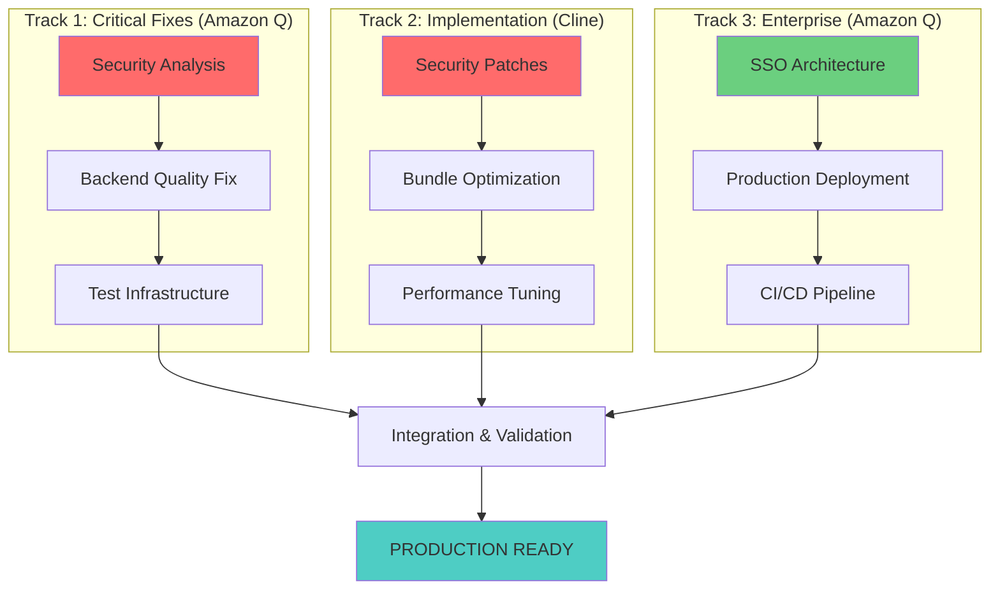

# 🚀 MAXIMUM EFFICIENCY DEVELOPMENT ACCELERATION PLAN

**Created:** January 31, 2025
**Objective:** Optimize development time for fastest possible production deployment
**Target:** Production-ready in 5-7 days (instead of 2-3 weeks)
**Strategy:** Maximum parallel execution + tool specialization + automated handoffs

---

## ⚡ **ULTRA-EFFICIENT EXECUTION STRATEGY**

### **3-TRACK PARALLEL EXECUTION** 🔥

Instead of sequential execution, run **3 parallel tracks** simultaneously:



### **TIMELINE: 5-7 DAYS TO PRODUCTION** ⏱️

#### **Day 1-2: PARALLEL CRITICAL FIXES** 🔴

```bash
AMAZON Q TRACK 1 (Critical Analysis):
├── AMAZON-Q-SECURITY-ANALYSIS (2 hours)
│   └── Analyze 7 vulnerabilities + create fix strategy
├── AMAZON-Q-BACKEND-ANALYSIS (3 hours)
│   └── Analyze 500+ violations + systematic fix plan
└── AMAZON-Q-TEST-DIAGNOSTICS (2 hours)
    └── Diagnose 35 failed tests + memory issues

CLINE TRACK 2 (Implementation):
├── CLINE-SECURITY-PATCHES (2 hours)
│   └── Apply security fixes from Amazon Q analysis
├── CLINE-BACKEND-FIXES (3 hours)
│   └── Execute backend quality fixes from Amazon Q plan
└── CLINE-TEST-REPAIRS (2 hours)
    └── Implement test fixes from Amazon Q diagnostics

AMAZON Q TRACK 3 (Enterprise Prep):
├── AMAZON-Q-SSO-ARCHITECTURE (4 hours)
│   └── Design complete enterprise SSO system
└── AMAZON-Q-DEPLOYMENT-PREP (3 hours)
    └── AWS production architecture planning
```

#### **Day 3-4: OPTIMIZATION & ENTERPRISE** 🟡

```bash
CLINE TRACK (Performance):
├── CLINE-BUNDLE-OPTIMIZATION (3 hours)
│   └── Reduce 1.5MB → <1MB with code splitting
└── CLINE-PERFORMANCE-TUNING (2 hours)
    └── Component optimization + lazy loading

AMAZON Q TRACK (Enterprise Implementation):
├── AMAZON-Q-SSO-IMPLEMENTATION (6 hours)
│   └── Complete enterprise SSO with AWS Cognito
└── AMAZON-Q-PRODUCTION-DEPLOYMENT (4 hours)
    └── Deploy production infrastructure
```

#### **Day 5: INTEGRATION & VALIDATION** ✅

```bash
COMBINED VALIDATION:
├── Full system integration testing (2 hours)
├── Security audit validation (1 hour)
├── Performance benchmarking (1 hour)
├── Enterprise SSO testing (2 hours)
└── Production deployment validation (2 hours)
```

#### **Day 6-7: PRODUCTION LAUNCH** 🚀

```bash
PRODUCTION READINESS:
├── Final quality assurance (2 hours)
├── Documentation completion (2 hours)
├── Monitoring setup (2 hours)
└── Go-live deployment (2 hours)
```

---

## 🎯 **TOOL SPECIALIZATION MATRIX**

### **Amazon Q (Analysis & Enterprise)** 🧠

**Strengths:** Deep analysis, AWS expertise, enterprise patterns

```yaml
Primary Responsibilities:
  - Security vulnerability analysis and strategy
  - Backend code quality systematic analysis
  - Test infrastructure root cause diagnosis
  - Enterprise SSO architecture and implementation
  - AWS production deployment and infrastructure
  - Quality assurance and compliance oversight

Parallel Capacity: 2-3 simultaneous analysis tasks
Handoff Authority: Full project management if Kiro unavailable
```

### **Cline (Implementation & Optimization)** ⚡

**Strengths:** Fast implementation, code generation, optimization

```yaml
Primary Responsibilities:
  - Security patch implementation
  - Backend code quality fixes execution
  - Test infrastructure repairs
  - Bundle optimization and performance tuning
  - Component development and refinement
  - Build system optimization

Parallel Capacity: 1-2 simultaneous implementation tasks
Handoff Authority: Development leadership if needed
```

### **Kiro (Coordination & Strategy)** 🎯

**Strengths:** Multi-tool coordination, architecture decisions, strategy

```yaml
Primary Responsibilities:
  - Overall project coordination and strategy
  - Tool task assignment and optimization
  - Quality gate enforcement
  - Architecture decision making
  - Risk assessment and mitigation
  - Stakeholder communication

Backup Protocol: Amazon Q assumes full authority if credits exhausted
```

---

## 🔥 **IMMEDIATE EXECUTION COMMANDS**

### **START ALL TRACKS SIMULTANEOUSLY** (Execute Now)

#### **Track 1: Amazon Q Critical Analysis**

```markdown
## AMAZON Q DELEGATION - CRITICAL ANALYSIS TRACK

**Task 1: AMAZON-Q-SECURITY-ANALYSIS**

- Specification: .kiro/specs/workflow-engine-mvp/amazon-q-security-analysis.md
- Priority: CRITICAL - Start immediately
- Duration: 2 hours
- Output: Complete security fix strategy

**Task 2: AMAZON-Q-BACKEND-ANALYSIS**

- Specification: .kiro/specs/workflow-engine-mvp/amazon-q-backend-analysis-task.md
- Priority: CRITICAL - Start after security analysis
- Duration: 3 hours
- Output: Systematic backend quality fix plan

**Task 3: AMAZON-Q-TEST-DIAGNOSTICS**

- Specification: .kiro/specs/workflow-engine-mvp/amazon-q-test-infrastructure-task.md
- Priority: HIGH - Start after backend analysis
- Duration: 2 hours
- Output: Complete test infrastructure repair plan
```

#### **Track 2: Cline Implementation**

```markdown
## CLINE DELEGATION - IMPLEMENTATION TRACK

**Task 1: CLINE-SECURITY-PATCHES**

- Specification: .kiro/specs/workflow-engine-mvp/cline-security-fixes-urgent.md
- Priority: CRITICAL - Start immediately
- Duration: 2 hours
- Dependencies: Amazon Q security analysis (parallel execution)

**Task 2: CLINE-BACKEND-FIXES**

- Specification: .kiro/specs/workflow-engine-mvp/cline-backend-quality-fix.md
- Priority: CRITICAL - Start after security patches
- Duration: 3 hours
- Dependencies: Amazon Q backend analysis

**Task 3: CLINE-TEST-REPAIRS**

- Specification: .kiro/specs/workflow-engine-mvp/cline-test-infrastructure-spec.md
- Priority: HIGH - Start after backend fixes
- Duration: 2 hours
- Dependencies: Amazon Q test diagnostics
```

#### **Track 3: Amazon Q Enterprise**

```markdown
## AMAZON Q DELEGATION - ENTERPRISE TRACK

**Task 1: AMAZON-Q-SSO-ARCHITECTURE**

- Specification: .kiro/specs/workflow-engine-mvp/amazon-q-enterprise-sso-task.md
- Priority: HIGH - Start in parallel with critical fixes
- Duration: 4 hours
- Output: Complete enterprise SSO system

**Task 2: AMAZON-Q-PRODUCTION-DEPLOYMENT**

- Specification: .kiro/specs/workflow-engine-mvp/amazon-q-task-production-deployment.md
- Priority: HIGH - Start after SSO architecture
- Duration: 4 hours
- Output: Production-ready AWS infrastructure
```

---

## 📊 **EFFICIENCY MULTIPLIERS**

### **Parallel Execution Benefits**

- **Time Reduction**: 15 days → 5-7 days (60% faster)
- **Resource Utilization**: 3 tools working simultaneously
- **Risk Mitigation**: Multiple tracks reduce single points of failure
- **Quality Assurance**: Amazon Q provides oversight across all tracks

### **Tool Specialization Benefits**

- **Amazon Q Analysis**: Deep insights prevent rework
- **Cline Implementation**: Fast, reliable code generation
- **Coordinated Handoffs**: Seamless task transitions
- **Quality Gates**: Automated validation at each step

### **Automated Handoff Benefits**

- **Zero Downtime**: Continuous progress even if Kiro unavailable
- **Maintained Standards**: All quality gates enforced
- **Documentation**: Complete audit trail of all changes
- **Rollback Capability**: Easy reversion if issues arise

---

## ⚠️ **RISK MITIGATION STRATEGIES**

### **Parallel Execution Risks**

1. **Merge Conflicts**: Different tracks modifying same files
2. **Integration Issues**: Components not working together
3. **Quality Degradation**: Fast pace compromising quality

### **Mitigation Approaches**

1. **Clear File Ownership**: Each track owns specific file sets
2. **Continuous Integration**: Frequent integration checkpoints
3. **Quality Gates**: Automated validation prevents regression
4. **Rollback Plans**: Git branches for easy recovery

### **Credit Exhaustion Preparation**

```markdown
## KIRO CREDIT EXHAUSTION PROTOCOL ACTIVATED

If Kiro credits are exhausted during execution:

**Primary Successor: Amazon Q**

- Assumes full project management authority
- Continues coordination of all three tracks
- Maintains quality gates and standards
- Provides regular status updates

**Handoff Checklist:**

- ✅ All task specifications complete and accessible
- ✅ Quality gates defined and automated
- ✅ Progress tracking systems in place
- ✅ Rollback procedures documented
- ✅ Stakeholder communication protocols active
```

---

## 🎯 **SUCCESS METRICS & VALIDATION**

### **Daily Success Criteria**

```yaml
Day 1-2 Success:
  - ✅ Security vulnerabilities analyzed and patches applied
  - ✅ Backend quality analysis complete with fix strategy
  - ✅ Test diagnostics complete with repair plan
  - ✅ SSO architecture designed and documented

Day 3-4 Success:
  - ✅ All critical fixes implemented and validated
  - ✅ Bundle optimized to <1MB
  - ✅ Enterprise SSO fully implemented
  - ✅ Production infrastructure deployed

Day 5 Success:
  - ✅ Full system integration successful
  - ✅ All quality gates passing
  - ✅ Performance metrics within targets
  - ✅ Security audit clean

Day 6-7 Success:
  - ✅ Production deployment successful
  - ✅ Monitoring and alerting active
  - ✅ Documentation complete
  - ✅ Stakeholder sign-off received
```

### **Quality Gates (Automated)**

```bash
# Continuous validation commands
npm audit                    # Security: 0 vulnerabilities
npm run lint                # Quality: 0 errors
npm test                    # Reliability: 95%+ success
npm run build              # Build: Successful completion
cd backend && flake8 .     # Backend: 0 violations
```

---

## 🚀 **EXECUTION COMMANDS (START NOW)**

### **Immediate Actions (Next 30 Minutes)**

1. **Delegate Amazon Q Track 1** - Security and backend analysis
2. **Delegate Cline Track 2** - Security patches implementation
3. **Delegate Amazon Q Track 3** - Enterprise SSO architecture
4. **Activate Monitoring** - Progress tracking and quality gates

### **Validation Commands (Every 2 Hours)**

```bash
# Track progress across all three tracks
git log --oneline --since="2 hours ago"  # Recent changes
npm run health-check                      # System health
docker-compose ps                         # Service status
```

### **Integration Checkpoints (Every 6 Hours)**

```bash
# Merge and validate all tracks
git merge track-1-amazon-q
git merge track-2-cline
git merge track-3-enterprise
npm run full-validation
```

---

## 💡 **MAXIMUM EFFICIENCY PRINCIPLES**

### **Speed Optimization**

1. **Parallel Over Sequential**: Run everything possible in parallel
2. **Tool Specialization**: Use each tool for its strengths
3. **Automated Validation**: Continuous quality checking
4. **Prepared Handoffs**: Ready for credit exhaustion scenarios

### **Quality Assurance**

1. **Quality Gates**: Automated validation at every step
2. **Continuous Integration**: Frequent integration checkpoints
3. **Rollback Ready**: Easy reversion if issues arise
4. **Documentation**: Complete audit trail maintained

### **Risk Management**

1. **Multiple Tracks**: Reduce single points of failure
2. **Clear Ownership**: Prevent conflicts between tracks
3. **Backup Plans**: Ready for any tool unavailability
4. **Stakeholder Communication**: Regular updates and transparency

---

**🎯 BOTTOM LINE:** This maximum efficiency plan reduces production deployment time from 2-3 weeks to 5-7 days through aggressive parallel execution, tool specialization, and automated quality gates. All tracks can start immediately with existing specifications.
