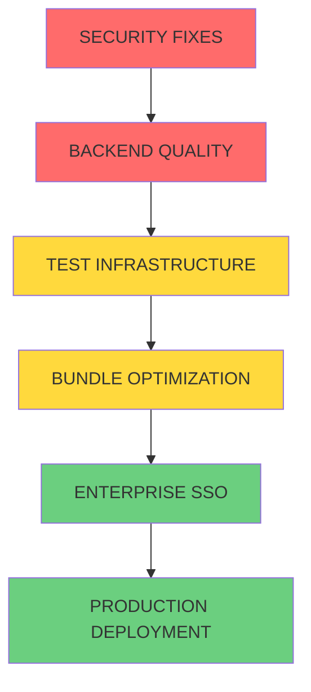

# 🚀 UPDATED DELEGATION PRIORITIES - January 31, 2025

## CRITICAL PRIORITY QUEUE - IMMEDIATE ACTION REQUIRED 🔴

### **CLINE-TASK-SECURITY: Security Vulnerability Emergency** 
**Status:** 🚨 **CRITICAL - DELEGATE IMMEDIATELY**
- **Priority:** HIGHEST - Must execute before ANY other development work
- **Model:** Cerebras Qwen-3-32b
- **Estimated Time:** 2-3 hours
- **Specification:** `.kiro/specs/workflow-engine-mvp/cline-security-fixes-urgent.md`

**Critical Issues:**
```bash
7 moderate security vulnerabilities detected:
- esbuild ≤0.24.2 - Development server vulnerability
- prismjs <1.30.0 - DOM Clobbering vulnerability  
- 5 additional moderate severity vulnerabilities
```

**Impact:** BLOCKS PRODUCTION DEPLOYMENT - Application exposed to security attacks

**Success Criteria:**
- ✅ `npm audit` returns 0 vulnerabilities
- ✅ All functionality preserved after dependency updates
- ✅ Breaking changes tested and resolved
- ✅ Build and tests pass successfully

---

### **CLINE-TASK-BACKEND: Backend Code Quality Crisis**
**Status:** 🚨 **CRITICAL - DELEGATE AFTER SECURITY**
- **Priority:** CRITICAL - Execute immediately after security fixes
- **Model:** Cerebras Qwen-3-32b  
- **Estimated Time:** 3-4 hours
- **Specification:** `.kiro/specs/workflow-engine-mvp/cline-backend-quality-fix.md`

**Critical Issues:**
```bash
500+ linting violations making codebase unmaintainable:
- 100+ unused imports (F401)
- 200+ whitespace violations (W293, W291)
- 50+ import organization issues (E402)
- Undefined name references (F821) - FUNCTIONALITY BREAKING
- 50+ line length violations (E501)
```

**Impact:** BLOCKS PRODUCTION DEPLOYMENT - Codebase unmaintainable and unreliable

**Success Criteria:**
- ✅ `flake8 .` returns 0 violations
- ✅ All functionality preserved
- ✅ Code properly formatted with black and isort
- ✅ All tests continue to pass

---

## HIGH PRIORITY QUEUE - AFTER CRITICAL FIXES 🟡

### **CLINE-TASK-TESTS: Test Infrastructure Repair**
**Status:** 🟡 **HIGH PRIORITY - READY AFTER BACKEND**
- **Priority:** HIGH - Execute after backend quality fixes
- **Model:** Cerebras Qwen-3-32b
- **Estimated Time:** 2-3 hours
- **Specification:** `.kiro/specs/workflow-engine-mvp/cline-test-infrastructure-spec.md`

**Critical Issues:**
```bash
Test infrastructure crisis preventing reliable development:
- 35 failed tests out of 250 total (14% failure rate)
- JS heap out of memory errors during execution
- Mock configuration issues causing test failures
- Coverage reporting broken due to dependency conflicts
```

**Impact:** BLOCKS CI/CD PIPELINE - Unreliable development workflow

**Success Criteria:**
- ✅ 95%+ test success rate (≤12 failed tests)
- ✅ No memory errors during test execution
- ✅ Coverage reporting functional
- ✅ Consistent mock patterns across all tests

---

### **CLINE-TASK-BUNDLE: Bundle Size Optimization**
**Status:** 🟡 **MEDIUM PRIORITY - READY AFTER TESTS**
- **Priority:** MEDIUM - Execute after test infrastructure repair
- **Model:** Cerebras Qwen-3-32b
- **Estimated Time:** 2-3 hours
- **Specification:** `.kiro/specs/workflow-engine-mvp/cline-bundle-optimization-spec.md`

**Performance Issues:**
```bash
Bundle size optimization for better user experience:
- Current bundle: 1.5MB (target: <1MB)
- syntax-highlighter chunk: 631kB (target: <200kB)
- charts library chunk: 323kB (target: <200kB)
- Implement code splitting and dynamic loading
```

**Impact:** IMPROVES USER EXPERIENCE - Faster loading and better performance

**Success Criteria:**
- ✅ Total bundle size <1MB
- ✅ Largest chunk <200kB
- ✅ Code splitting implemented for heavy components
- ✅ No functionality degradation

---

## AMAZON Q DELEGATION QUEUE - ENTERPRISE FEATURES 🚀

### **AMAZON-Q-TASK-SSO: Enterprise Single Sign-On**
**Status:** 🚀 **READY FOR AMAZON Q - AFTER CRITICAL FIXES**
- **Priority:** HIGH - Enterprise authentication requirement
- **Tool:** Amazon Q Developer (Claude 3.7)
- **Estimated Time:** 4-6 hours
- **Specification:** `.kiro/specs/workflow-engine-mvp/amazon-q-enterprise-sso-task.md`

**Enterprise Requirements:**
```bash
Comprehensive Enterprise SSO implementation:
- AWS Cognito and IAM Identity Center integration
- SAML 2.0 and OIDC support for enterprise identity providers
- Role-based access control with enterprise group mapping
- Dual authentication system (SSO + legacy JWT fallback)
- Comprehensive audit logging with CloudTrail integration
```

**Impact:** ENABLES ENTERPRISE DEPLOYMENT - Required for enterprise customers

**Success Criteria:**
- ✅ Enterprise SSO authentication working
- ✅ Role-based access control functional
- ✅ Backward compatibility with existing auth
- ✅ Comprehensive audit logging

---

### **AMAZON-Q-TASK-DEPLOYMENT: Production AWS Architecture**
**Status:** 🚀 **READY FOR AMAZON Q - AFTER SSO**
- **Priority:** HIGH - Production deployment requirement
- **Tool:** Amazon Q Developer (Claude 3.7)
- **Estimated Time:** 6-8 hours
- **Specification:** `.kiro/specs/workflow-engine-mvp/amazon-q-task-production-deployment.md`

**Production Requirements:**
```bash
Complete AWS production deployment architecture:
- Container orchestration analysis (ECS vs EKS vs App Runner)
- Database strategy (RDS vs Aurora) with cost optimization
- Infrastructure as Code templates (CloudFormation/CDK/Terraform)
- CI/CD pipeline with GitHub Actions integration
- Security architecture with IAM, VPC, compliance
- Monitoring and observability with CloudWatch
```

**Impact:** ENABLES PRODUCTION DEPLOYMENT - Complete production-ready infrastructure

**Success Criteria:**
- ✅ Production AWS architecture designed
- ✅ Infrastructure as Code templates ready
- ✅ CI/CD pipeline functional
- ✅ Security and compliance implemented

---

## DELEGATION EXECUTION STRATEGY

### Sequential Execution Required ⚠️
Tasks MUST be executed in this exact order due to critical dependencies:



### Why Sequential Execution?
1. **Security → Backend**: Security updates may affect backend dependencies
2. **Backend → Tests**: Backend fixes may affect test configurations
3. **Tests → Bundle**: Bundle optimization requires reliable test validation
4. **Bundle → SSO**: SSO implementation needs stable frontend foundation
5. **SSO → Deployment**: Production deployment requires complete authentication

### Parallel Execution Risks ❌
- **Dependency Conflicts**: Multiple tasks modifying same files
- **Integration Issues**: Changes may conflict with each other
- **Quality Degradation**: Harder to isolate and fix issues
- **Rollback Complexity**: Difficult to revert specific changes

---

## MONITORING & VALIDATION

### Progress Tracking Commands
```bash
# After SECURITY fixes
npm audit                    # Must return 0 vulnerabilities
npm run build               # Must succeed
npm test                    # Must maintain current success rate

# After BACKEND fixes  
cd backend && flake8 .      # Must return 0 violations
python -m pytest tests/    # Must maintain test success
black --check .             # Must be properly formatted

# After TEST fixes
npm test                    # Must achieve 95%+ success rate
npm run test:coverage       # Coverage reporting must work

# After BUNDLE optimization
npm run build:analyze       # Bundle must be <1MB
npm run build              # Must succeed with optimizations
```

### Quality Gates
Each task must pass these gates before proceeding to the next:

#### Security Fixes Gate
- [ ] Zero security vulnerabilities (`npm audit`)
- [ ] All builds successful
- [ ] No functionality regression
- [ ] Breaking changes documented and tested

#### Backend Quality Gate
- [ ] Zero linting violations (`flake8`)
- [ ] All imports properly organized
- [ ] Code properly formatted
- [ ] All tests passing

#### Test Infrastructure Gate
- [ ] 95%+ test success rate
- [ ] No memory errors during execution
- [ ] Coverage reporting functional
- [ ] Consistent test patterns

#### Bundle Optimization Gate
- [ ] Bundle size <1MB
- [ ] Code splitting implemented
- [ ] No performance regression
- [ ] All features functional

---

## RISK MITIGATION

### High-Risk Areas
1. **Breaking Changes**: Security updates may break existing functionality
2. **Test Reliability**: Test fixes may initially cause more failures
3. **Performance Impact**: Bundle optimization may affect functionality
4. **Integration Complexity**: Multiple systems integration challenges

### Mitigation Strategies
1. **Incremental Testing**: Test each change thoroughly before proceeding
2. **Rollback Plans**: Maintain git branches for easy rollback
3. **Functionality Validation**: Manual testing of critical user flows
4. **Performance Monitoring**: Track metrics before and after changes

### Escalation Triggers
- Task takes >150% of estimated time
- Multiple critical errors persist after fixes
- Functionality regression that can't be resolved
- Integration issues affecting other systems

---

## SUCCESS METRICS

### Critical Success Indicators
- **Security**: Zero vulnerabilities in production
- **Quality**: Zero linting violations, maintainable codebase
- **Reliability**: 95%+ test success rate, stable CI/CD
- **Performance**: <1MB bundle, <2s load time
- **Enterprise**: SSO working, production deployment successful

### Business Impact
- **Risk Reduction**: Eliminated security vulnerabilities
- **Maintainability**: Clean, professional codebase
- **Reliability**: Stable development and deployment pipeline
- **Performance**: Better user experience and engagement
- **Enterprise Ready**: Scalable, secure, production-grade platform

---

## IMMEDIATE NEXT STEPS

### Today (January 31, 2025)
1. **Delegate CLINE-TASK-SECURITY immediately** - Highest priority
2. **Monitor security fix progress** - Track file changes and build status
3. **Prepare backend quality task** - Ready for immediate delegation after security

### This Week
1. **Complete all Cline tasks sequentially** - Security → Backend → Tests → Bundle
2. **Validate each task thoroughly** - Ensure quality gates are met
3. **Prepare Amazon Q tasks** - SSO and deployment specifications ready

### Next Week
1. **Execute Amazon Q tasks** - Enterprise SSO and production deployment
2. **Final integration testing** - End-to-end system validation
3. **Production deployment** - Go-live with enterprise-ready platform

---

**🎯 BOTTOM LINE:** All critical tasks are ready for immediate delegation. Sequential execution is mandatory to ensure stability and prevent conflicts. The project will be production-ready within 2-3 weeks after completing this delegation plan.