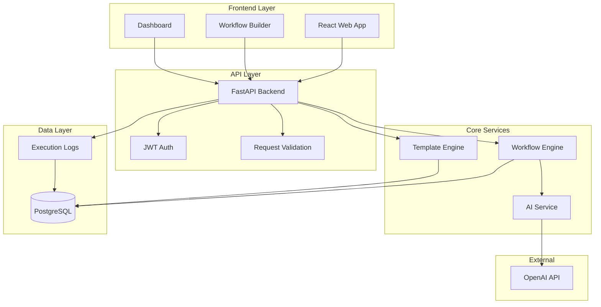

# Design Document

## Overview

The AutoMatrix AI Hub Workflow Engine MVP is designed as a simplified, single-tenant workflow automation platform that demonstrates core AI-powered workflow capabilities for automotive dealerships. The system uses a modern web architecture with FastAPI backend, React frontend, and PostgreSQL database to provide a drag-and-drop workflow builder, execution engine, and basic monitoring capabilities.

The MVP prioritizes rapid development and deployment over scalability, focusing on proving the core concept before building enterprise-grade features. This approach allows for quick validation of the workflow automation concept while maintaining a clear path to scale.

## Architecture

### High-Level Architecture



### Technology Stack

- **Backend**: FastAPI (Python 3.11+) with Pydantic for data validation
- **Frontend**: React 18 with TypeScript, Tailwind CSS for styling
- **Database**: PostgreSQL 15 with SQLAlchemy ORM
- **Authentication**: JWT tokens with simple session management
- **AI Integration**: OpenAI GPT-4 API via official Python client
- **Workflow Visualization**: React Flow for drag-and-drop interface
- **Deployment**: Docker containers with docker-compose for local development

## Components and Interfaces

### Frontend Components

#### Workflow Builder

- **Purpose**: Visual drag-and-drop interface for creating workflows
- **Key Features**:
  - Canvas-based workflow designer using React Flow
  - Component palette with predefined workflow nodes
  - Connection validation and visual feedback
  - Real-time workflow validation
- **Interface**: Communicates with backend via REST API for CRUD operations

#### Dashboard

- **Purpose**: Monitoring and analytics interface for workflow executions
- **Key Features**:
  - Execution history table with filtering
  - Basic success/failure metrics
  - Error log viewing
  - Workflow performance charts
- **Interface**: Polls backend API for execution data and metrics

#### Template Library

- **Purpose**: Pre-built workflow templates for common use cases
- **Key Features**:
  - Template browsing and preview
  - Template instantiation with parameter customization
  - Template categories (Sales, Service, Parts)
- **Interface**: REST API for template management

### Backend Services

#### Workflow Engine

- **Purpose**: Core workflow execution and orchestration
- **Key Features**:
  - Sequential workflow execution
  - Step-by-step logging and error handling
  - AI model integration for processing steps
  - Execution state management
- **Interface**:
  ```python
  class WorkflowEngine:
      async def execute_workflow(self, workflow_id: str, input_data: dict) -> ExecutionResult
      async def get_execution_status(self, execution_id: str) -> ExecutionStatus
      async def cancel_execution(self, execution_id: str) -> bool
  ```

#### AI Service

- **Purpose**: Abstraction layer for AI model interactions
- **Key Features**:
  - OpenAI GPT integration
  - Prompt template management
  - Response parsing and validation
  - Error handling and retries
- **Interface**:
  ```python
  class AIService:
      async def process_text(self, prompt: str, context: dict) -> AIResponse
      async def validate_response(self, response: str, schema: dict) -> bool
  ```

#### Template Engine

- **Purpose**: Management of workflow templates and instantiation
- **Key Features**:
  - Template storage and retrieval
  - Parameter substitution
  - Template validation
- **Interface**:
  ```python
  class TemplateEngine:
      async def get_templates(self, category: str = None) -> List[Template]
      async def instantiate_template(self, template_id: str, params: dict) -> Workflow
  ```

### API Endpoints

#### Workflow Management

- `POST /api/workflows` - Create new workflow
- `GET /api/workflows` - List user workflows
- `GET /api/workflows/{id}` - Get workflow details
- `PUT /api/workflows/{id}` - Update workflow
- `DELETE /api/workflows/{id}` - Delete workflow

#### Workflow Execution

- `POST /api/workflows/{id}/execute` - Start workflow execution
- `GET /api/executions/{id}` - Get execution status
- `GET /api/executions/{id}/logs` - Get execution logs
- `POST /api/executions/{id}/cancel` - Cancel execution

#### Templates

- `GET /api/templates` - List available templates
- `GET /api/templates/{id}` - Get template details
- `POST /api/templates/{id}/instantiate` - Create workflow from template

#### Authentication

- `POST /api/auth/login` - User login
- `POST /api/auth/logout` - User logout
- `GET /api/auth/me` - Get current user info

## Data Models

### Core Entities

#### User

```python
class User(BaseModel):
    id: UUID
    email: str
    name: str
    created_at: datetime
    is_active: bool
```

#### Workflow

```python
class Workflow(BaseModel):
    id: UUID
    name: str
    description: str
    user_id: UUID
    definition: dict  # JSON workflow definition
    created_at: datetime
    updated_at: datetime
    is_active: bool
```

#### WorkflowExecution

```python
class WorkflowExecution(BaseModel):
    id: UUID
    workflow_id: UUID
    status: ExecutionStatus  # PENDING, RUNNING, COMPLETED, FAILED
    input_data: dict
    output_data: dict
    started_at: datetime
    completed_at: Optional[datetime]
    error_message: Optional[str]
```

#### ExecutionLog

```python
class ExecutionLog(BaseModel):
    id: UUID
    execution_id: UUID
    step_name: str
    step_type: str
    input_data: dict
    output_data: dict
    duration_ms: int
    timestamp: datetime
    error_message: Optional[str]
```

#### Template

```python
class Template(BaseModel):
    id: UUID
    name: str
    description: str
    category: str
    definition: dict
    parameters: List[TemplateParameter]
    created_at: datetime
```

### Database Schema

The PostgreSQL database will use the following table structure:

- `users` - User accounts and authentication
- `workflows` - Workflow definitions and metadata
- `workflow_executions` - Execution instances and results
- `execution_logs` - Detailed step-by-step execution logs
- `templates` - Pre-built workflow templates
- `template_parameters` - Template configuration parameters

## Error Handling

### Frontend Error Handling

- Global error boundary for React components
- Toast notifications for user-facing errors
- Form validation with real-time feedback
- Network error handling with retry mechanisms

### Backend Error Handling

- Structured exception hierarchy with custom exception types
- Automatic error logging with correlation IDs
- Graceful degradation for AI service failures
- Input validation with detailed error messages

### Workflow Execution Error Handling

- Step-level error capture and logging
- Workflow execution rollback on critical failures
- Retry mechanisms for transient failures
- Clear error reporting to users

## Testing Strategy

### Unit Testing

- **Backend**: pytest with async support for all service classes
- **Frontend**: Jest and React Testing Library for component testing
- **Coverage Target**: 80% code coverage minimum

### Integration Testing

- API endpoint testing with test database
- Workflow execution end-to-end testing
- AI service integration testing with mocked responses
- Database migration testing

### Manual Testing

- User acceptance testing for workflow builder
- Cross-browser compatibility testing
- Performance testing for workflow execution
- Security testing for authentication flows

### Test Data Management

- Seed data for development and testing environments
- Test workflow templates for common scenarios
- Mock AI responses for consistent testing
- Database fixtures for integration tests
