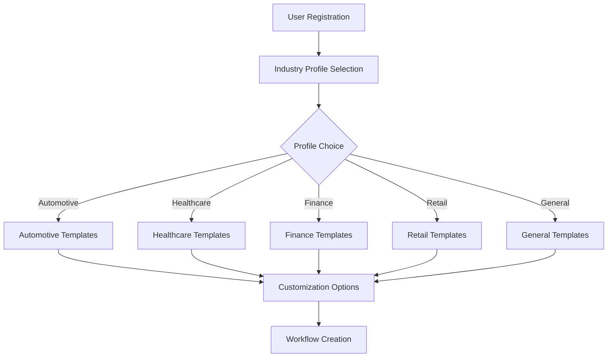

# Industry Profile System - Dynamic Specialization Architecture

## 🎯 **Overview**

The Auterity platform uses a **dynamic industry profile system** that allows users to configure specialized workflows, AI models, and templates for any industry while maintaining a generalized core platform.

## 🏗️ **Architecture Design**

### **Core Principle**
- **Generalized Platform**: Universal workflow automation capabilities
- **Industry Profiles**: Dynamic configuration layers for specialization
- **User Choice**: Select industry profile or use general configuration

### **Database Schema**
```sql
-- Industry profile definitions
CREATE TABLE industry_profiles (
    id VARCHAR(50) PRIMARY KEY,
    name VARCHAR(255) NOT NULL,
    description TEXT,
    template_categories JSONB,
    ai_model_preferences JSONB,
    workflow_patterns JSONB,
    compliance_requirements JSONB,
    created_at TIMESTAMP
);

-- Tenant industry configuration
ALTER TABLE tenants ADD COLUMN industry_profile VARCHAR(50) REFERENCES industry_profiles(id);
ALTER TABLE tenants ADD COLUMN profile_settings JSONB;

-- User-level profile preferences
ALTER TABLE users ADD COLUMN preferred_profile VARCHAR(50) REFERENCES industry_profiles(id);
ALTER TABLE users ADD COLUMN profile_customizations JSONB;
```

## 📋 **Available Industry Profiles**

### **1. Automotive Profile**
```yaml
id: "automotive"
name: "Automotive Industry"
description: "Specialized workflows for automotive dealerships and service centers"
template_categories:
  - service_operations
  - sales_processes
  - finance_insurance
  - parts_management
  - customer_service
ai_model_preferences:
  - automotive_service_advisor
  - vehicle_diagnostics
  - customer_communication
workflow_patterns:
  - appointment_scheduling
  - service_estimation
  - warranty_processing
compliance_requirements:
  - automotive_standards
  - dealer_regulations
```

### **2. Healthcare Profile**
```yaml
id: "healthcare"
name: "Healthcare Industry"
description: "HIPAA-compliant workflows for healthcare providers"
template_categories:
  - patient_intake
  - appointment_management
  - clinical_workflows
  - billing_processes
  - compliance_tracking
ai_model_preferences:
  - medical_assistant
  - appointment_scheduler
  - billing_processor
workflow_patterns:
  - patient_onboarding
  - treatment_planning
  - insurance_verification
compliance_requirements:
  - hipaa
  - hitech
  - medical_standards
```

### **3. Finance Profile**
```yaml
id: "finance"
name: "Financial Services"
description: "Regulatory-compliant workflows for financial institutions"
template_categories:
  - loan_processing
  - risk_assessment
  - compliance_reporting
  - customer_onboarding
  - fraud_detection
ai_model_preferences:
  - financial_advisor
  - risk_analyzer
  - compliance_checker
workflow_patterns:
  - credit_evaluation
  - regulatory_reporting
  - customer_verification
compliance_requirements:
  - sox
  - pci_dss
  - banking_regulations
```

### **4. Retail Profile**
```yaml
id: "retail"
name: "Retail Industry"
description: "Customer-focused workflows for retail operations"
template_categories:
  - inventory_management
  - customer_service
  - order_fulfillment
  - marketing_automation
  - supply_chain
ai_model_preferences:
  - customer_service_agent
  - inventory_optimizer
  - marketing_assistant
workflow_patterns:
  - order_processing
  - customer_support
  - inventory_replenishment
compliance_requirements:
  - retail_standards
  - consumer_protection
```

### **5. General Profile**
```yaml
id: "general"
name: "General Purpose"
description: "Flexible workflows for any industry or use case"
template_categories:
  - project_management
  - data_processing
  - approval_workflows
  - communication
  - reporting
ai_model_preferences:
  - general_assistant
  - data_processor
  - workflow_coordinator
workflow_patterns:
  - generic_approval
  - data_transformation
  - notification_system
compliance_requirements:
  - gdpr
  - basic_security
```

## 🔧 **Implementation Architecture**

### **Profile Selection Interface**
```typescript
interface IndustryProfileSelector {
  availableProfiles: IndustryProfile[];
  selectedProfile: string;
  customizations: ProfileCustomizations;
  
  selectProfile(profileId: string): void;
  customizeProfile(settings: ProfileSettings): void;
  resetToDefaults(): void;
}

interface IndustryProfile {
  id: string;
  name: string;
  description: string;
  templateCategories: string[];
  aiModelPreferences: AIModelConfig[];
  workflowPatterns: WorkflowPattern[];
  complianceRequirements: string[];
}
```

### **Dynamic Template Loading**
```typescript
class TemplateService {
  async getTemplatesForProfile(profileId: string): Promise<Template[]> {
    const profile = await this.getProfile(profileId);
    const templates = await this.templateRepository.findByCategories(
      profile.templateCategories
    );
    return this.applyProfileCustomizations(templates, profile);
  }
  
  async createWorkflowFromTemplate(
    templateId: string, 
    profileId: string,
    customizations: any
  ): Promise<Workflow> {
    const template = await this.getTemplate(templateId);
    const profile = await this.getProfile(profileId);
    return this.instantiateWithProfile(template, profile, customizations);
  }
}
```

### **AI Model Routing by Profile**
```typescript
class ProfileAwareAIRouter {
  async routeRequest(request: AIRequest, profileId: string): Promise<AIResponse> {
    const profile = await this.getProfile(profileId);
    const preferredModels = profile.aiModelPreferences;
    
    // Route to profile-specific models first
    for (const modelConfig of preferredModels) {
      if (await this.isModelAvailable(modelConfig.modelId)) {
        return await this.callModel(modelConfig.modelId, request);
      }
    }
    
    // Fallback to general models
    return await this.routeToGeneralModel(request);
  }
}
```

## 🎨 **User Experience Design**

### **Profile Selection Flow**


### **Profile Customization Interface**
```typescript
interface ProfileCustomizationUI {
  // Industry-specific settings
  industrySettings: {
    complianceLevel: 'basic' | 'standard' | 'strict';
    aiModelPreference: 'speed' | 'accuracy' | 'cost';
    templateComplexity: 'simple' | 'intermediate' | 'advanced';
  };
  
  // Custom template categories
  customCategories: string[];
  
  // Workflow pattern preferences
  workflowPreferences: {
    approvalLevels: number;
    automationLevel: 'manual' | 'semi' | 'full';
    errorHandling: 'strict' | 'lenient';
  };
  
  // Compliance requirements
  complianceSettings: {
    requiredStandards: string[];
    auditLogging: boolean;
    dataRetention: number; // days
  };
}
```

## 📊 **Profile Analytics & Insights**

### **Usage Analytics by Profile**
```typescript
class ProfileAnalytics {
  async getProfileUsageStats(profileId: string): Promise<ProfileStats> {
    return {
      totalUsers: await this.countUsersByProfile(profileId),
      activeWorkflows: await this.countActiveWorkflows(profileId),
      templateUsage: await this.getTemplateUsageByProfile(profileId),
      aiModelUsage: await this.getAIUsageByProfile(profileId),
      complianceScore: await this.calculateComplianceScore(profileId)
    };
  }
  
  async getProfileRecommendations(userId: string): Promise<Recommendation[]> {
    const userProfile = await this.getUserProfile(userId);
    const usagePatterns = await this.getUserUsagePatterns(userId);
    return this.generateRecommendations(userProfile, usagePatterns);
  }
}
```

### **Cross-Profile Insights**
```typescript
interface CrossProfileInsights {
  popularTemplates: {
    profileId: string;
    templateId: string;
    usageCount: number;
  }[];
  
  profileMigrations: {
    fromProfile: string;
    toProfile: string;
    migrationCount: number;
  }[];
  
  complianceComparison: {
    profileId: string;
    complianceScore: number;
    commonIssues: string[];
  }[];
}
```

## 🔄 **Profile Migration & Evolution**

### **Profile Switching**
```typescript
class ProfileMigrationService {
  async migrateUserProfile(
    userId: string, 
    fromProfile: string, 
    toProfile: string
  ): Promise<MigrationResult> {
    // Analyze existing workflows
    const workflows = await this.getUserWorkflows(userId);
    const compatibilityReport = await this.analyzeCompatibility(workflows, toProfile);
    
    // Migrate compatible workflows
    const migrationPlan = await this.createMigrationPlan(workflows, toProfile);
    const results = await this.executeMigration(migrationPlan);
    
    return {
      migratedWorkflows: results.successful,
      failedMigrations: results.failed,
      recommendedActions: results.recommendations
    };
  }
}
```

### **Profile Evolution**
```typescript
class ProfileEvolutionService {
  async suggestProfileUpdates(profileId: string): Promise<ProfileUpdate[]> {
    const usageData = await this.getProfileUsageData(profileId);
    const industryTrends = await this.getIndustryTrends(profileId);
    
    return this.generateUpdateSuggestions(usageData, industryTrends);
  }
  
  async createCustomProfile(
    baseProfileId: string, 
    customizations: ProfileCustomizations
  ): Promise<IndustryProfile> {
    const baseProfile = await this.getProfile(baseProfileId);
    return this.mergeCustomizations(baseProfile, customizations);
  }
}
```

## 🛡️ **Compliance & Security by Profile**

### **Profile-Specific Compliance**
```typescript
interface ComplianceEngine {
  validateWorkflow(workflow: Workflow, profileId: string): Promise<ComplianceResult>;
  enforceDataRetention(profileId: string): Promise<void>;
  generateComplianceReport(profileId: string): Promise<ComplianceReport>;
  auditProfileAccess(profileId: string): Promise<AuditLog[]>;
}

class HealthcareComplianceEngine implements ComplianceEngine {
  async validateWorkflow(workflow: Workflow): Promise<ComplianceResult> {
    // HIPAA-specific validation
    const phiHandling = this.validatePHIHandling(workflow);
    const accessControls = this.validateAccessControls(workflow);
    const auditLogging = this.validateAuditLogging(workflow);
    
    return {
      compliant: phiHandling && accessControls && auditLogging,
      violations: this.collectViolations([phiHandling, accessControls, auditLogging]),
      recommendations: this.generateRecommendations(workflow)
    };
  }
}
```

## 🚀 **Deployment Strategy**

### **Profile-Aware Infrastructure**
```yaml
# Kubernetes deployment with profile support
apiVersion: apps/v1
kind: Deployment
metadata:
  name: auterity-profile-engine
spec:
  template:
    spec:
      containers:
      - name: profile-service
        image: auterity/profile-engine:latest
        env:
        - name: SUPPORTED_PROFILES
          value: "automotive,healthcare,finance,retail,general"
        - name: PROFILE_TEMPLATES_PATH
          value: "/app/profiles"
        volumeMounts:
        - name: profile-templates
          mountPath: /app/profiles
      volumes:
      - name: profile-templates
        configMap:
          name: industry-profiles
```

### **Profile Template Management**
```bash
# Profile template structure
profiles/
├── automotive/
│   ├── templates/
│   ├── models/
│   └── compliance/
├── healthcare/
│   ├── templates/
│   ├── models/
│   └── compliance/
├── finance/
│   ├── templates/
│   ├── models/
│   └── compliance/
├── retail/
│   ├── templates/
│   ├── models/
│   └── compliance/
└── general/
    ├── templates/
    ├── models/
    └── compliance/
```

## 📈 **Business Benefits**

### **Market Expansion**
- **Broader Addressable Market**: Not limited to automotive industry
- **Industry Expertise**: Specialized configurations for multiple verticals
- **Competitive Differentiation**: Industry-adaptive platform vs generic solutions

### **Customer Value**
- **Faster Time-to-Value**: Pre-configured industry templates
- **Compliance Assurance**: Built-in regulatory requirements
- **Scalability**: Easy expansion to new industries or use cases

### **Technical Advantages**
- **Maintainable Codebase**: Single platform with configurable specializations
- **Rapid Deployment**: New industry profiles without core platform changes
- **Community Growth**: Industry-specific communities around profiles

---

## 🎯 **Implementation Priority**

### **Phase 1: Core Profile System**
1. Database schema for industry profiles
2. Profile selection and management UI
3. Template categorization by profile
4. Basic AI model routing by profile

### **Phase 2: Profile Specialization**
1. Industry-specific compliance engines
2. Profile-aware analytics and reporting
3. Custom profile creation tools
4. Profile migration capabilities

### **Phase 3: Advanced Features**
1. Cross-profile insights and recommendations
2. Industry trend analysis and profile evolution
3. Marketplace for industry-specific extensions
4. Partner ecosystem for profile development

This industry profile system transforms Auterity from an automotive-focused platform into a **universal workflow automation platform** that can specialize dynamically for any industry while maintaining the benefits of a unified architecture.