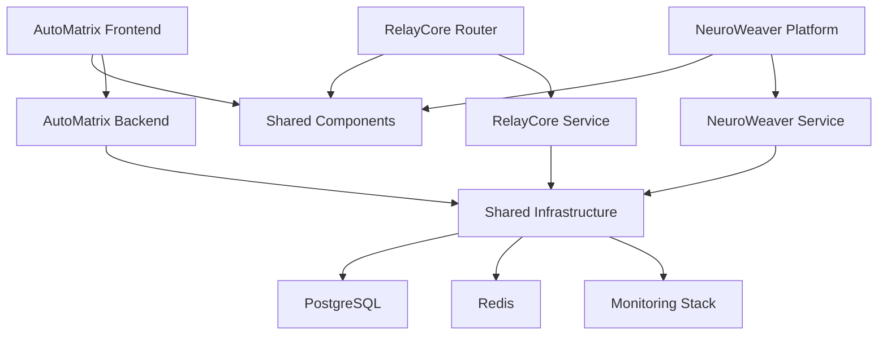

# Open-Source Components in Auterity Platform

[](https://opensource.org/licenses/MIT)
[](CONTRIBUTING.md)
[](https://github.com/toobutta/auterity-error-iq/issues)

## 🎯 **Overview**

The Auterity platform integrates several powerful open-source components that can be used independently or as part of the unified system. Each component is production-ready and follows open-source best practices.

## 🏗️ **Core Open-Source Components**

### 1. **RelayCore** - AI Request Router & Cost Optimizer
**Location**: `/systems/relaycore/` + `/PRD/RelayCore/`  
**Language**: TypeScript/Node.js  
**Purpose**: Intelligent AI request routing with cost optimization  

[](docs/components/relaycore/README.md)
[](https://hub.docker.com/r/auterity/relaycore)

**Key Features**:
- Multi-provider AI routing (OpenAI, Anthropic, Claude)
- Real-time cost optimization and budget management
- Configurable steering rules engine
- Performance monitoring and analytics
- Plugin system for IDE integrations

**Standalone Usage**:
```bash
docker run -p 3001:3001 auterity/relaycore:latest
```

### 2. **NeuroWeaver** - ML Model Management Platform
**Location**: `/systems/neuroweaver/` + `/PRD/TuneDev/`  
**Language**: Python/FastAPI + React/TypeScript  
**Purpose**: Specialized AI model training and deployment  

[](docs/components/neuroweaver/README.md)
[](https://hub.docker.com/r/auterity/neuroweaver)

**Key Features**:
- Automated model fine-tuning pipeline
- Industry-adaptive templates and profile kits
- Performance monitoring and A/B testing
- Model registry and version management
- Kubernetes-native deployment

**Standalone Usage**:
```bash
docker run -p 3002:3002 auterity/neuroweaver:latest
```

### 3. **AutoMatrix Workflow Engine** - Visual Workflow Automation
**Location**: `/backend/` + `/frontend/`  
**Language**: Python/FastAPI + React/TypeScript  
**Purpose**: Visual workflow builder with AI integration  

[](docs/components/autmatrix/README.md)
[](https://hub.docker.com/r/auterity/autmatrix)

**Key Features**:
- Drag-and-drop workflow builder (React Flow)
- Template system with parameterization
- Topological sorting and parallel execution
- Real-time monitoring and error recovery
- Enterprise authentication and multi-tenancy

**Standalone Usage**:
```bash
docker-compose -f docker-compose.component.yml up autmatrix
```

### 4. **Shared Component Library** - Reusable UI Components
**Location**: `/shared/`  
**Language**: React/TypeScript  
**Purpose**: Cross-system UI components and utilities  

[](docs/components/shared/README.md)
[](https://www.npmjs.com/package/@auterity/shared)

**Key Features**:
- Design system with consistent tokens
- Reusable React components
- Cross-system API clients
- Error handling and monitoring hooks
- Accessibility-compliant components

**Standalone Usage**:
```bash
npm install @auterity/shared
```

## 🔧 **IDE Plugins & Extensions**

### **RelayCore IDE Integrations**
**Location**: `/PRD/RelayCore/relaycore-backend/plugins/`

#### VSCode Extension
- **Path**: `plugins/vscode/`
- **Features**: AI request routing, cost monitoring, steering rules
- **Install**: Search "RelayCore" in VSCode marketplace

#### JetBrains Plugin  
- **Path**: `plugins/jetbrains/`
- **Features**: Code analysis, AI suggestions, performance metrics
- **Install**: Available in JetBrains marketplace

#### Claude CLI Integration
- **Path**: `plugins/claude-cli/`
- **Features**: Command-line AI routing, batch processing
- **Install**: `npm install -g @auterity/claude-relay`

#### Amazon Kiro Plugin
- **Path**: `plugins/amazon-kiro/`
- **Features**: Kiro integration, error intelligence
- **Install**: Available through Kiro marketplace

## 📊 **Component Architecture**



## 🚀 **Quick Start Guide**

### **Option 1: Full Platform**
```bash
git clone https://github.com/toobutta/auterity-error-iq.git
cd auterity-error-iq
docker-compose up
```

### **Option 2: Individual Components**
```bash
# RelayCore only
docker run -p 3001:3001 auterity/relaycore:latest

# NeuroWeaver only  
docker run -p 3002:3002 auterity/neuroweaver:latest

# AutoMatrix only
docker-compose -f docker-compose.component.yml up autmatrix
```

### **Option 3: Development Setup**
```bash
# Backend development
cd backend && pip install -r requirements.txt && uvicorn app.main:app --reload

# Frontend development
cd frontend && npm install && npm run dev

# RelayCore development
cd systems/relaycore && npm install && npm run dev

# NeuroWeaver development
cd systems/neuroweaver && pip install -r requirements.txt && python -m app.main
```

## 📚 **Documentation Structure**

```
docs/
├── components/
│   ├── relaycore/
│   │   ├── README.md              # Component overview
│   │   ├── API.md                 # API documentation
│   │   ├── DEPLOYMENT.md          # Deployment guide
│   │   └── CONTRIBUTING.md        # Contribution guidelines
│   ├── neuroweaver/
│   │   ├── README.md
│   │   ├── TRAINING.md            # Model training guide
│   │   ├── TEMPLATES.md           # Vertical kit documentation
│   │   └── CONTRIBUTING.md
│   ├── autmatrix/
│   │   ├── README.md
│   │   ├── WORKFLOWS.md           # Workflow creation guide
│   │   ├── TEMPLATES.md           # Template system
│   │   └── CONTRIBUTING.md
│   └── shared/
│       ├── README.md
│       ├── COMPONENTS.md          # Component library
│       ├── DESIGN_SYSTEM.md       # Design tokens
│       └── CONTRIBUTING.md
└── integration/
    ├── CROSS_SYSTEM.md            # Integration patterns
    ├── AUTHENTICATION.md          # Unified auth
    └── MONITORING.md              # Observability
```

## 🤝 **Contributing**

We welcome contributions to any component! Each component has specific contribution guidelines:

- **[RelayCore Contributing Guide](docs/components/relaycore/CONTRIBUTING.md)**
- **[NeuroWeaver Contributing Guide](docs/components/neuroweaver/CONTRIBUTING.md)**  
- **[AutoMatrix Contributing Guide](docs/components/autmatrix/CONTRIBUTING.md)**
- **[Shared Library Contributing Guide](docs/components/shared/CONTRIBUTING.md)**

### **General Contribution Process**
1. Fork the repository
2. Create a feature branch for the specific component
3. Follow component-specific coding standards
4. Add tests for your changes
5. Update component documentation
6. Submit a pull request with component label

## 🏷️ **Component Labels & Tags**

Use these labels when creating issues or pull requests:

- `component:relaycore` - RelayCore AI router issues
- `component:neuroweaver` - NeuroWeaver ML platform issues  
- `component:autmatrix` - AutoMatrix workflow engine issues
- `component:shared` - Shared library issues
- `component:integration` - Cross-system integration issues

## 📈 **Component Status**

| Component | Status | Version | Tests | Coverage | Docker |
|-----------|--------|---------|-------|----------|--------|
| RelayCore | ✅ Stable | v1.2.0 | ✅ Passing | 92% | ✅ Available |
| NeuroWeaver | ✅ Stable | v1.1.0 | ✅ Passing | 88% | ✅ Available |
| AutoMatrix | ✅ Stable | v1.3.0 | ⚠️ Fixing | 85% | ✅ Available |
| Shared Library | ✅ Stable | v1.0.5 | ✅ Passing | 95% | ✅ Available |

## 🔗 **Links & Resources**

- **[Main Documentation](docs/README.md)**
- **[API Reference](docs/API_SPECIFICATIONS.md)**
- **[Architecture Overview](docs/ARCHITECTURE_OVERVIEW.md)**
- **[Deployment Guide](docs/DEPLOYMENT_GUIDE.md)**
- **[Security Guide](docs/SECURITY_GUIDE.md)**

## 📄 **License**

Each component is licensed under the MIT License - see the [LICENSE](LICENSE) file for details.

## 🆘 **Support**

- **GitHub Issues**: [Create an issue](https://github.com/toobutta/auterity-error-iq/issues)
- **Discussions**: [GitHub Discussions](https://github.com/toobutta/auterity-error-iq/discussions)
- **Documentation**: [Full Documentation](docs/README.md)

---

**Made with ❤️ by the Auterity team and open-source contributors**