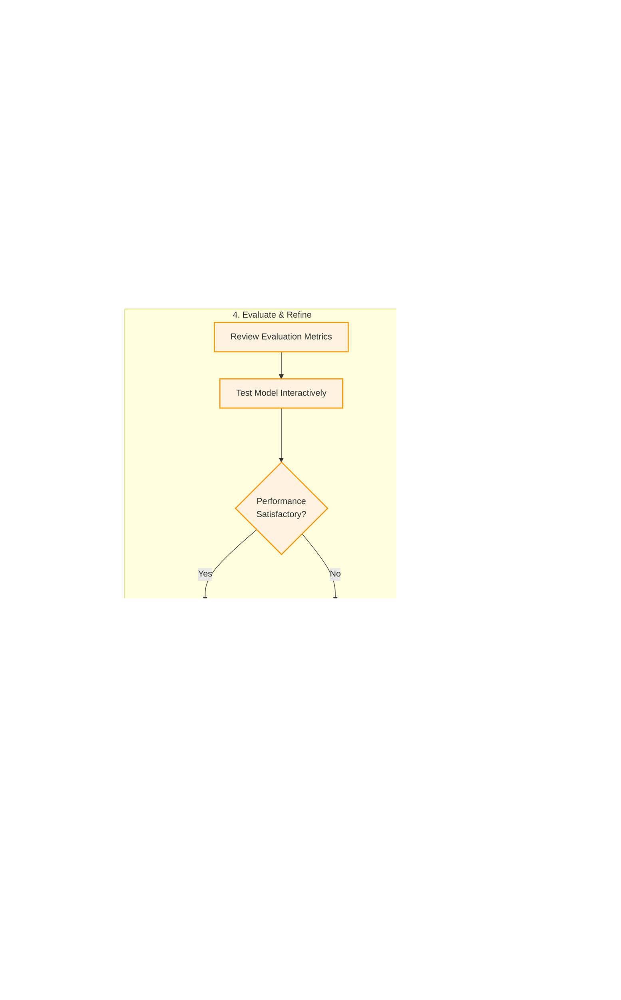

# Customer Journey Diagram: Model Specialization with NeuroWeaver

The diagram above illustrates the end-to-end process a customer follows to specialize an AI model using the NeuroWeaver platform. This visual representation highlights the five key stages of the journey and the specific steps within each stage.

## Journey Stages

### 1. Select Template (Purple)
The customer begins by browsing the Model Gallery, selecting the Automotive Dealership Kit, and choosing the Service Advisor Template that best fits their needs.

### 2. Prepare Dataset (Green)
The customer uploads their service records dataset, refines it using the platform's tools, and analyzes the dataset quality to ensure it meets the requirements.

### 3. Configure & Train (Blue)
With a template and dataset ready, the customer reviews the pre-filled configuration, makes any necessary adjustments, starts the training process, and monitors progress.

### 4. Evaluate & Refine (Orange)
After training, the customer reviews evaluation metrics, tests the model interactively, and decides whether to proceed to deployment or refine the model further.

### 5. Deploy & Integrate (Pink)
Finally, the customer configures deployment settings, deploys the model, selects an integration method (API, connectors, or no-code), and monitors the model's performance.

## Key Decision Points

The diagram highlights a critical decision point in the Evaluate & Refine stage, where the customer determines if the model's performance meets their requirements. If not, they can iterate through additional refinement cycles until the model achieves satisfactory performance.

## Integration Options

The diagram also illustrates the three integration paths available to customers:
1. Direct API integration for technical teams
2. Pre-built connectors for common dealership systems
3. No-code integration options for non-technical users

This flexible approach ensures that customers of all technical capabilities can successfully integrate the specialized model into their operations.