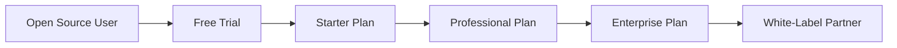

# SaaS & White-Label Transition Plan - Auterity Platform

## 🎯 **Executive Summary**

**Objective**: Transform Auterity from open-source platform to enterprise SaaS with white-label capabilities  
**Timeline**: 6-month phased approach  
**Investment Required**: $150K-$300K (development + infrastructure)  
**Revenue Potential**: $50K-$500K ARR within 12 months  

## 📊 **Current State Analysis**

### **✅ SaaS-Ready Assets**
- **Production-ready three-system architecture** (AutoMatrix + RelayCore + NeuroWeaver)
- **Enterprise authentication** (JWT, SSO support)
- **Multi-tenant database schema** foundation
- **Containerized deployment** (Docker + Kubernetes ready)
- **Monitoring stack** (Prometheus, Grafana, Jaeger)
- **API-first architecture** with comprehensive endpoints

### **🔧 Required Enhancements**
- **Multi-tenancy isolation** and data segregation
- **Billing and subscription management** system
- **White-label customization** engine
- **Enterprise admin portal** and user management
- **Usage analytics** and reporting dashboard
- **Compliance and security** certifications

## 🏗️ **SaaS Architecture Design**

### **Multi-Tenant Data Model**
```sql
-- Tenant isolation at database level
CREATE TABLE tenants (
    id UUID PRIMARY KEY,
    name VARCHAR(255) NOT NULL,
    domain VARCHAR(255) UNIQUE,
    plan_type VARCHAR(50), -- starter, professional, enterprise
    industry_profile VARCHAR(50), -- automotive, healthcare, finance, retail, general
    created_at TIMESTAMP,
    settings JSONB
);

-- Industry-specific configurations
CREATE TABLE industry_profiles (
    id VARCHAR(50) PRIMARY KEY,
    name VARCHAR(255) NOT NULL,
    description TEXT,
    template_categories JSONB,
    ai_model_preferences JSONB,
    workflow_templates JSONB,
    created_at TIMESTAMP
);

-- All existing tables get tenant_id
ALTER TABLE users ADD COLUMN tenant_id UUID REFERENCES tenants(id);
ALTER TABLE workflows ADD COLUMN tenant_id UUID REFERENCES tenants(id);
ALTER TABLE ai_requests ADD COLUMN tenant_id UUID REFERENCES tenants(id);
```

### **White-Label Customization Schema**
```sql
CREATE TABLE tenant_branding (
    tenant_id UUID REFERENCES tenants(id),
    logo_url VARCHAR(500),
    primary_color VARCHAR(7),
    secondary_color VARCHAR(7),
    custom_domain VARCHAR(255),
    company_name VARCHAR(255),
    custom_css TEXT,
    updated_at TIMESTAMP
);
```

## 📋 **Phase-by-Phase Implementation Plan**

### **Phase 1: Multi-Tenancy Foundation (Months 1-2)**

#### **1.1 Database Multi-Tenancy** 
**Timeline**: 3 weeks  
**Investment**: $15K  

```typescript
// Tenant context middleware
export class TenantMiddleware {
  async use(req: Request, res: Response, next: NextFunction) {
    const tenantId = this.extractTenantId(req);
    req.tenant = await this.tenantService.getTenant(tenantId);
    next();
  }
}

// Row-level security for all queries
class TenantAwareRepository {
  async find(criteria: any, tenantId: string) {
    return this.repository.find({
      ...criteria,
      tenant_id: tenantId
    });
  }
}
```

#### **1.2 Tenant Management System**
**Timeline**: 2 weeks  
**Investment**: $10K  

- Tenant registration and onboarding
- Domain-based tenant resolution
- Tenant settings and configuration
- Basic admin portal for tenant management

#### **1.3 Authentication Enhancement**
**Timeline**: 2 weeks  
**Investment**: $8K  

- Tenant-scoped user authentication
- SSO configuration per tenant
- Role-based permissions per tenant
- API key management per tenant

### **Phase 2: Billing & Subscription (Months 2-3)**

#### **2.1 Subscription Management**
**Timeline**: 4 weeks  
**Investment**: $25K  

```typescript
// Subscription plans
interface SubscriptionPlan {
  id: string;
  name: string;
  price: number;
  features: {
    maxUsers: number;
    maxWorkflows: number;
    aiRequestsPerMonth: number;
    customBranding: boolean;
    ssoSupport: boolean;
  };
}

// Usage tracking
class UsageTracker {
  async trackAIRequest(tenantId: string, cost: number) {
    await this.usageRepository.increment(tenantId, 'ai_requests', cost);
  }
  
  async checkLimits(tenantId: string): Promise<boolean> {
    const usage = await this.getCurrentUsage(tenantId);
    const plan = await this.getSubscriptionPlan(tenantId);
    return usage.aiRequests < plan.features.aiRequestsPerMonth;
  }
}
```

#### **2.2 Payment Integration**
**Timeline**: 2 weeks  
**Investment**: $12K  

- Stripe integration for subscription billing
- Usage-based billing for AI requests
- Invoice generation and management
- Payment failure handling and dunning

#### **2.3 Usage Analytics Dashboard**
**Timeline**: 2 weeks  
**Investment**: $10K  

- Real-time usage monitoring per tenant
- Cost tracking and budget alerts
- Performance analytics and reporting
- Billing history and invoice access

### **Phase 3: White-Label Customization (Months 3-4)**

#### **3.1 Branding Engine**
**Timeline**: 3 weeks  
**Investment**: $20K  

```typescript
// Dynamic theming system
interface TenantTheme {
  primaryColor: string;
  secondaryColor: string;
  logoUrl: string;
  companyName: string;
  customCss?: string;
}

class BrandingService {
  async generateTheme(tenantId: string): Promise<TenantTheme> {
    const branding = await this.getBranding(tenantId);
    return {
      primaryColor: branding.primaryColor || '#3B82F6',
      secondaryColor: branding.secondaryColor || '#10B981',
      logoUrl: branding.logoUrl || '/default-logo.png',
      companyName: branding.companyName || 'Auterity',
      customCss: branding.customCss
    };
  }
}
```

#### **3.2 Custom Domain Support**
**Timeline**: 2 weeks  
**Investment**: $8K  

- Subdomain routing (tenant.auterity.com)
- Custom domain configuration (customer.com)
- SSL certificate management
- DNS configuration automation

#### **3.3 White-Label Admin Portal**
**Timeline**: 3 weeks  
**Investment**: $15K  

- Branding customization interface
- Logo and color scheme management
- Custom CSS editor with preview
- Domain configuration panel

### **Phase 4: Enterprise Features (Months 4-5)**

#### **4.1 Advanced Admin Portal**
**Timeline**: 4 weeks  
**Investment**: $30K  

```typescript
// Enterprise admin features
class EnterpriseAdminService {
  async getUserAnalytics(tenantId: string) {
    return {
      totalUsers: await this.countUsers(tenantId),
      activeUsers: await this.countActiveUsers(tenantId),
      workflowsCreated: await this.countWorkflows(tenantId),
      aiRequestsThisMonth: await this.getMonthlyAIRequests(tenantId)
    };
  }
  
  async exportData(tenantId: string, format: 'csv' | 'json') {
    // GDPR-compliant data export
  }
}
```

#### **4.2 Compliance & Security**
**Timeline**: 3 weeks  
**Investment**: $20K  

- SOC 2 Type II compliance preparation
- GDPR compliance features (data export, deletion)
- Enhanced audit logging per tenant
- Security scanning and vulnerability management

#### **4.3 API Management**
**Timeline**: 2 weeks  
**Investment**: $10K  

- Tenant-specific API keys and rate limiting
- API usage analytics per tenant
- Webhook configuration per tenant
- API documentation portal per tenant

### **Phase 5: Advanced Analytics & AI (Months 5-6)**

#### **5.1 Business Intelligence Dashboard**
**Timeline**: 3 weeks  
**Investment**: $25K  

- Executive dashboard with KPIs
- Workflow performance analytics
- AI cost optimization recommendations
- Predictive usage analytics

#### **5.2 AI-Powered Features**
**Timeline**: 3 weeks  
**Investment**: $20K  

- Intelligent workflow recommendations
- Automated cost optimization
- Anomaly detection for usage patterns
- AI-powered customer success insights

#### **5.3 Integration Marketplace**
**Timeline**: 2 weeks  
**Investment**: $15K  

- Third-party integration catalog
- Custom integration builder
- Webhook and API connector library
- Partner ecosystem development

## 💰 **Pricing Strategy**

### **SaaS Pricing Tiers**

#### **Starter Plan - $99/month**
- Up to 5 users
- 100 workflows
- 10,000 AI requests/month
- Basic support
- Community templates

#### **Professional Plan - $299/month**
- Up to 25 users
- Unlimited workflows
- 50,000 AI requests/month
- Priority support
- Custom branding
- SSO integration

#### **Enterprise Plan - $999/month**
- Unlimited users
- Unlimited workflows
- 200,000 AI requests/month
- Dedicated support
- Full white-label
- Custom integrations
- On-premise deployment option

### **White-Label Pricing**

#### **White-Label Starter - $499/month**
- Professional plan features
- Custom domain
- Logo and color customization
- Remove Auterity branding

#### **White-Label Enterprise - $1,999/month**
- Enterprise plan features
- Full UI customization
- Custom CSS support
- Dedicated infrastructure
- Partner program access

## 🏢 **Go-to-Market Strategy**

### **Target Markets**

#### **Primary: Enterprise Process Automation**
- **Market Size**: $12B workflow automation market
- **Pain Points**: Complex integrations, high development costs, vendor lock-in
- **Value Proposition**: No-code automation, AI integration, rapid deployment

#### **Secondary: Industry-Specific Solutions**
- **Automotive**: 16,000+ dealerships (service, sales, F&I workflows)
- **Healthcare**: 6,000+ hospitals (patient workflows, compliance)
- **Finance**: 5,000+ banks (loan processing, compliance)
- **Retail**: 1M+ retailers (inventory, customer service)
- **Manufacturing**: 250K+ facilities (quality control, supply chain)

#### **Tertiary: White-Label Partners**
- **Market Size**: 1,000+ software vendors and consultants
- **Pain Points**: Build vs buy decisions, time to market, feature differentiation
- **Value Proposition**: Ready-to-deploy platform, revenue sharing, co-branding

### **Sales Strategy**

#### **Direct Sales (Months 1-6)**
- **Target**: 10 enterprise customers
- **Average Deal Size**: $50K-$200K annually
- **Sales Cycle**: 3-6 months
- **Revenue Target**: $500K ARR

#### **Partner Channel (Months 6-12)**
- **Target**: 5 white-label partners
- **Revenue Share**: 30-50% to partners
- **Partner Investment**: $100K in partner enablement
- **Revenue Target**: $1M ARR through partners

## 📊 **Financial Projections**

### **Development Investment**
| Phase | Timeline | Investment | Key Deliverables |
|-------|----------|------------|------------------|
| Phase 1 | Months 1-2 | $33K | Multi-tenancy foundation |
| Phase 2 | Months 2-3 | $47K | Billing & subscriptions |
| Phase 3 | Months 3-4 | $43K | White-label customization |
| Phase 4 | Months 4-5 | $60K | Enterprise features |
| Phase 5 | Months 5-6 | $60K | Advanced analytics & AI |
| **Total** | **6 months** | **$243K** | **Complete SaaS platform** |

### **Revenue Projections**
| Month | Customers | MRR | ARR | Cumulative Revenue |
|-------|-----------|-----|-----|-------------------|
| Month 3 | 2 | $2K | $24K | $6K |
| Month 6 | 8 | $12K | $144K | $42K |
| Month 9 | 15 | $28K | $336K | $126K |
| Month 12 | 25 | $50K | $600K | $276K |

### **Break-Even Analysis**
- **Development Cost**: $243K
- **Monthly Operating Cost**: $15K (infrastructure + support)
- **Break-Even Point**: Month 8 (15 customers)
- **ROI Timeline**: 18 months

## 🔧 **Technical Implementation**

### **Infrastructure Requirements**

#### **Multi-Tenant Database**
```yaml
# Database scaling for multi-tenancy
database:
  primary: PostgreSQL 15 with row-level security
  read_replicas: 2 instances for analytics
  connection_pooling: PgBouncer with tenant routing
  backup_strategy: Per-tenant backup and restore
```

#### **Container Orchestration**
```yaml
# Kubernetes deployment for SaaS
apiVersion: apps/v1
kind: Deployment
metadata:
  name: auterity-saas
spec:
  replicas: 3
  template:
    spec:
      containers:
      - name: auterity-backend
        image: auterity/saas-backend:latest
        env:
        - name: MULTI_TENANT_MODE
          value: "true"
        - name: BILLING_ENABLED
          value: "true"
```

#### **Monitoring & Observability**
```yaml
# SaaS-specific monitoring
monitoring:
  tenant_metrics: Per-tenant resource usage
  billing_metrics: Usage tracking for billing
  performance_metrics: Response times per tenant
  security_metrics: Authentication and access logs
```

### **Security Enhancements**

#### **Data Isolation**
- **Database**: Row-level security with tenant_id
- **Storage**: Tenant-specific S3 buckets
- **Caching**: Tenant-namespaced Redis keys
- **Logging**: Tenant-scoped log aggregation

#### **Compliance Features**
- **GDPR**: Data export, deletion, and consent management
- **SOC 2**: Audit logging, access controls, encryption
- **HIPAA**: Enhanced data protection for healthcare clients
- **ISO 27001**: Security management system implementation

## 🚀 **Migration Strategy**

### **Open-Source to SaaS Transition**

#### **Dual-Track Approach**
1. **Open-Source**: Continue community development
2. **SaaS**: Enterprise features and hosting
3. **Clear Differentiation**: Open-source for developers, SaaS for enterprises

#### **Customer Migration Path**


### **Risk Mitigation**

#### **Technical Risks**
- **Multi-tenancy bugs**: Comprehensive testing with tenant isolation
- **Performance degradation**: Load testing with multiple tenants
- **Data leakage**: Security audits and penetration testing

#### **Business Risks**
- **Market competition**: Differentiate with automotive specialization
- **Customer acquisition**: Partner with automotive consultants
- **Churn prevention**: Customer success team and onboarding

## 📈 **Success Metrics**

### **Technical KPIs**
- **Uptime**: 99.9% availability
- **Performance**: <2s response time per tenant
- **Security**: Zero data breaches
- **Scalability**: Support 1000+ tenants

### **Business KPIs**
- **Customer Acquisition**: 25 customers by month 12
- **Revenue Growth**: $600K ARR by month 12
- **Churn Rate**: <5% monthly churn
- **Customer Satisfaction**: >90% NPS score

### **Product KPIs**
- **Feature Adoption**: >80% use core features
- **API Usage**: >1M API calls/month
- **White-Label Partners**: 5 active partners
- **Integration Usage**: >50% use integrations

## 🎯 **Immediate Next Steps (Week 1-2)**

### **1. Technical Foundation**
- [ ] Design multi-tenant database schema
- [ ] Implement tenant middleware and context
- [ ] Set up development environment for SaaS features
- [ ] Create tenant onboarding API endpoints

### **2. Business Preparation**
- [ ] Finalize pricing strategy and packaging
- [ ] Develop sales materials and demos
- [ ] Create customer onboarding process
- [ ] Set up billing infrastructure (Stripe)

### **3. Legal & Compliance**
- [ ] Update terms of service for SaaS model
- [ ] Create privacy policy for multi-tenant data
- [ ] Prepare SOC 2 compliance documentation
- [ ] Establish data processing agreements

### **4. Market Validation**
- [ ] Interview 10 potential enterprise customers
- [ ] Validate pricing with automotive dealerships
- [ ] Identify potential white-label partners
- [ ] Create MVP feature prioritization

## 💡 **Competitive Advantages**

### **Technical Differentiators**
- **Three-system architecture** provides comprehensive AI platform
- **Dynamic industry profiles** with adaptive AI models
- **Cost optimization** with RelayCore routing
- **Open-source foundation** builds trust and community

### **Business Differentiators**
- **Multi-industry expertise** with specialized workflows
- **Proven ROI** with 40% cost reduction across industries
- **Flexible deployment** (SaaS, on-premise, white-label)
- **Industry-agnostic platform** with specialized configurations

---

## 🎉 **Conclusion**

The Auterity platform is **exceptionally well-positioned** for SaaS and white-label transition with:

✅ **Strong Technical Foundation**: Production-ready architecture with enterprise features  
✅ **Clear Market Opportunity**: $12B workflow automation market with automotive specialization  
✅ **Proven Value Proposition**: 40% cost reduction and AI-powered automation  
✅ **Multiple Revenue Streams**: Direct SaaS, white-label, and partner channels  

**Investment**: $243K over 6 months  
**Revenue Potential**: $600K ARR by month 12  
**Break-Even**: Month 8  
**ROI**: 18-month payback period  

**Recommendation**: Proceed with Phase 1 implementation immediately to capture market opportunity and establish competitive positioning.